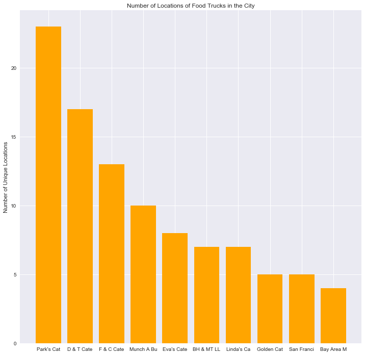
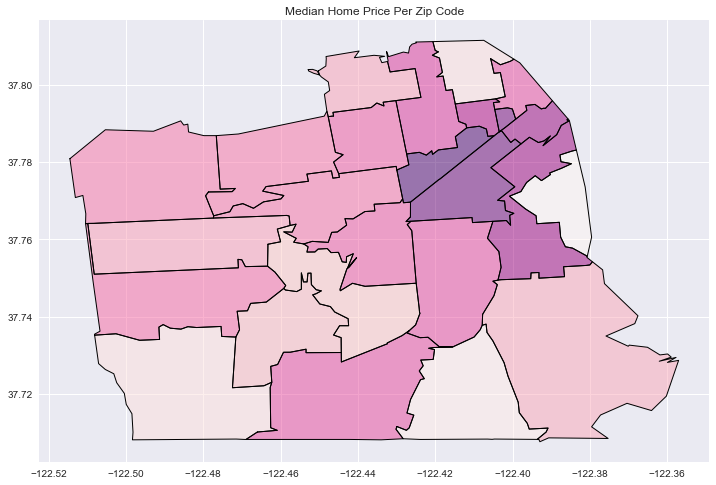
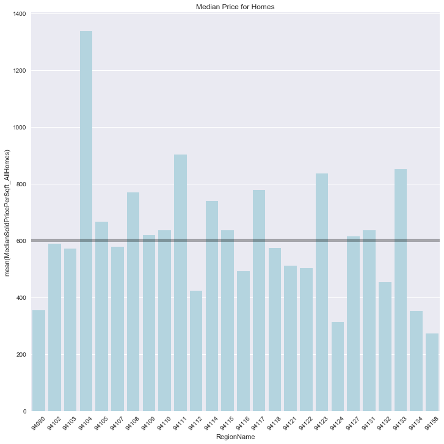
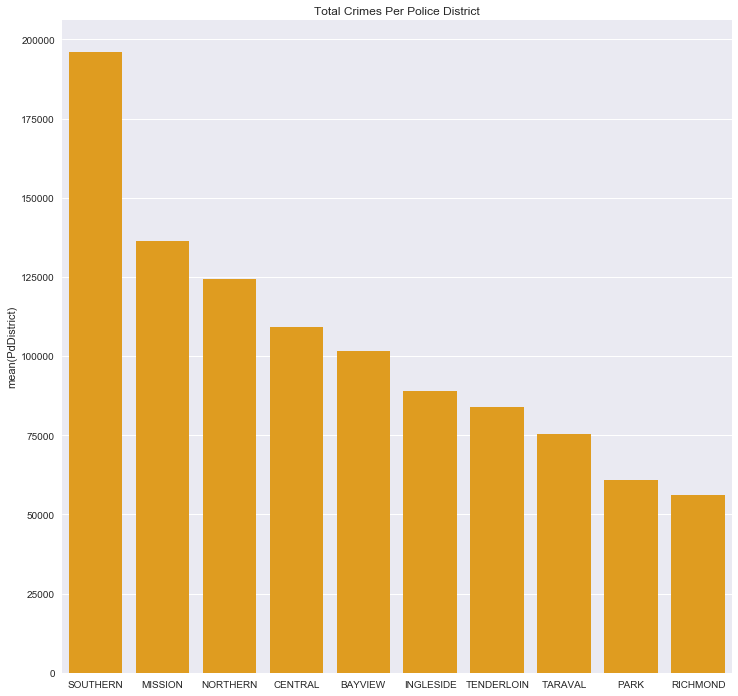
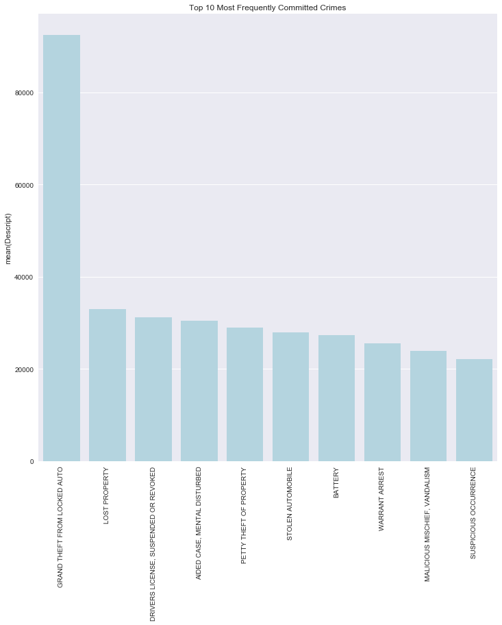
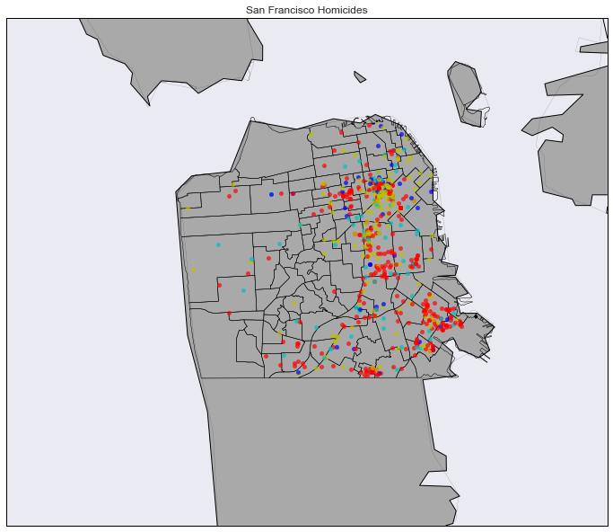
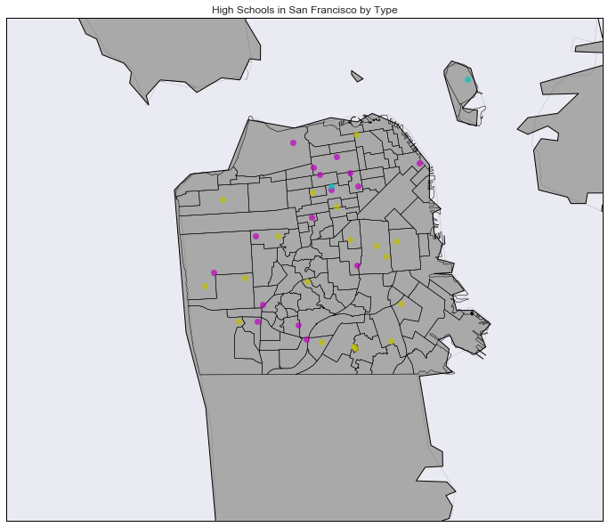
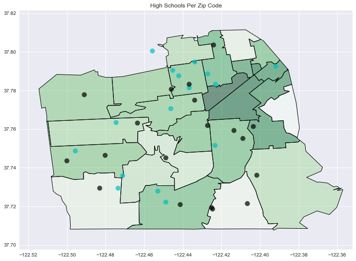

<font color="navy">
### Edie Espejo
2017-03-13

# San Francisco Data (SQl and Mapping)

<font color="navy">
## Sources

Refer to the picture on the right to identify the most friendly people in this class.
<br>
I referred to the following websites.
<ol>
<li>http://basemaptutorial.readthedocs.io/en/latest/shapefile.html</li>
<li>http://matplotlib.org/users/colormaps.html</li>
<li>http://brandonrose.org/pythonmap</li>
<li>https://geohackweek.github.io/vector/04-geopandas-intro/</li>
</ol>

## Libraries
I used the following libraries.


```python
# SQL
import sqlite3 as sql

# YOUR FAVORITE DATA SCIENCE LIBRARIES
import pandas as pd
import numpy as np
```


```python
# DISPLAY PLOTS INLINE
%matplotlib inline

# MAKE 'EM PLOTS BIG
import seaborn as sns
import matplotlib.pyplot as plt
plt.rcParams['figure.figsize'] = (12, 12)

# MAPS
from mpl_toolkits.basemap import Basemap
import geopandas as gpd
import shapely.geometry as geom
```

<font color="navy">
# Exercise 1.1
In the following exercise, I will be extracting information about the food trucks from the SQL database.


```python
# LOAD IN DATA BASE
db = sql.connect("sf_data.sqlite")
```


```python
# QUERY TOP 10
top10 = pd.read_sql("SELECT Applicant, count(Applicant) AS num_permits FROM mobile_food_permits AS mfp "
                    "INNER JOIN (SELECT DISTINCT locationid, permit FROM mobile_food_schedule) "
                    "AS mfs ON mfp.permit=mfs.permit WHERE mfp.Status=='APPROVED' GROUP BY mfp.Applicant "
                    "ORDER By num_permits DESC LIMIT 10", db)
top10
```


<div>
<table border="1" class="dataframe">
  <thead>
    <tr style="text-align: right;">
      <th></th>
      <th>Applicant</th>
      <th>num_permits</th>
    </tr>
  </thead>
  <tbody>
    <tr>
      <th>0</th>
      <td>Park's Catering</td>
      <td>23</td>
    </tr>
    <tr>
      <th>1</th>
      <td>D &amp; T Catering</td>
      <td>17</td>
    </tr>
    <tr>
      <th>2</th>
      <td>F &amp; C Catering</td>
      <td>13</td>
    </tr>
    <tr>
      <th>3</th>
      <td>Munch A Bunch</td>
      <td>10</td>
    </tr>
    <tr>
      <th>4</th>
      <td>Eva's Catering</td>
      <td>8</td>
    </tr>
    <tr>
      <th>5</th>
      <td>BH &amp; MT LLC</td>
      <td>7</td>
    </tr>
    <tr>
      <th>6</th>
      <td>Linda's Catering</td>
      <td>7</td>
    </tr>
    <tr>
      <th>7</th>
      <td>Golden Catering</td>
      <td>5</td>
    </tr>
    <tr>
      <th>8</th>
      <td>San Francisco Carts &amp; Concessions, Inc. DBA St...</td>
      <td>5</td>
    </tr>
    <tr>
      <th>9</th>
      <td>Bay Area Mobile Catering, Inc. dba. Taqueria A...</td>
      <td>4</td>
    </tr>
  </tbody>
</table>
</div>


<font color="navy">
<b>Park's Catering sells in the most areas in the City, holding 23 permits for 23 locations.</b> D&T Catering is second with 17 locations, and F&C Catering is third with 13 locations. In the printed output above, we see the rest of the top 10.


```python
# INITIALIZE GRAPH OBJECTS
objects = list(top10.Applicant.values)
objects_abb = [name[:10] for name in objects]
y_pos = np.arange(len(objects))

# PLOTTING DATA
plt.bar(y_pos, top10["num_permits"][:15], color="orange")

# #Set up the graphs
plt.xticks(y_pos, objects_abb, rotation = "horizontal")
plt.ylabel("Number of Unique Locations")
plt.title("Number of Locations of Food Trucks in the City")
plt.show()
```





<font color="navy">
# Exercise 1.2
As I progress through Exercise 1.2, I will be analyzing some topics that I find most relevant, having been born and raised in the City.
<br><br>
(1) What are the most and least expensive parts of the City?
<br>
(2) What are the most common types of crime? Where do crimes happen most?
<br>
(3) Where do homicides happen in the City?
<br>
(4) What is the relationship between elementary and high schools in the City?
<br>
(5) What is the distribution of high schools in the City?

<font color="navy">
# (1) What are the most and least expensive parts of the City? 
I will first select the median prices per square foot of homes and the zip codes of the corresponding region.
<br>
<br>
<b>Question 1 Contents</b>
<br>
(a) Most Expensive Zipcode Regions of the City
<br>
(b) Least Expensive Zipcode Regions of the City
<br>
(c) Map Visualization of Median Home Price per Zipcode Region


```python
prices_per_zip = pd.read_sql("SELECT RegionName, MedianSoldPricePerSqft_AllHomes FROM zillow WHERE MedianSoldPricePerSqft_AllHomes>0 GROUP BY RegionName", db)
prices_per_zip = prices_per_zip.sort_values(by="MedianSoldPricePerSqft_AllHomes", ascending=False)
top3_bottom3 = prices_per_zip.iloc[[0, 1, 2, len(prices_per_zip)-3, len(prices_per_zip)-2, len(prices_per_zip)-1]]
top3_bottom3
```


<div>
<table border="1" class="dataframe">
  <thead>
    <tr style="text-align: right;">
      <th></th>
      <th>RegionName</th>
      <th>MedianSoldPricePerSqft_AllHomes</th>
    </tr>
  </thead>
  <tbody>
    <tr>
      <th>3</th>
      <td>94104</td>
      <td>1336.128581</td>
    </tr>
    <tr>
      <th>9</th>
      <td>94111</td>
      <td>901.804100</td>
    </tr>
    <tr>
      <th>23</th>
      <td>94133</td>
      <td>850.666667</td>
    </tr>
    <tr>
      <th>24</th>
      <td>94134</td>
      <td>351.758200</td>
    </tr>
    <tr>
      <th>19</th>
      <td>94124</td>
      <td>312.412600</td>
    </tr>
    <tr>
      <th>25</th>
      <td>94158</td>
      <td>273.033708</td>
    </tr>
  </tbody>
</table>
</div>


<font color="navy">
### (a) Most Expensive Zipcode Regions of the City 
<br>
94104: Downtown, the Financial District
<br>
94111: Embaracdero
<br>
94133: North Beach
<br>
<br>
As a San Francisco native, I am no alien to the bustle and lure of the downtown area. The Financial District is the center of business in downtown, decorated with the tallest skyscrapers in the city. As expected, the type of housing in this area is loft and apartment style in tall, glamorous buildings suitable for the monied professionals that work in the area.
<br>
<br>
The Embaracdero, one of the first neighborhoods in sight as you enter the city through the Bay Bridge, is one of the city's most popular tourist areas, boasting a beautiful view of the newly built Bay Bridge, a concert grounds, and museums along the walk of the coast. The apartments in that area also high rise with a timeless feel which are unsurprisingly expensive.
<br>
<br>
North Beach, not far off from the two neighborhoods previously mentioned packs in the same San Franciscan integrity, but moreso in large concrete homes than in multistory apartment buildings. Easy access to downtown facilities and the homes being large would definitely make the area more expensive.

### (b) Least Expensive Zipcode Regions of the City
<br>
94134: Visitacion Valley
<br>
94124: Hunter's Point
<br>
94158: Mission Bay
<br>
<br>
Visitacion Valley "the Viz" is the neighborhood in which I was born and raised. The area is known for violence and unkept streets. Growing up, my mom frequently had to clean grafitti off our walls (I do think that San Franciscan graffiti is a charm, it was not pretty on our house), and we were not unaccustomed to car break ins and crime in the area. My father was the manager in the Walgreens in the Viz, and he was riddled with catching shoplifters on a daily basis. Despite the homey look and feel of the Viz, the amount of crime makes it unappealing to the bougie newcomers.
<br>
<br>
Hunter's Point and Mission Bay are both known for their low-income housing. However, due to the gentrification (or redevelopment, if you're unfortunately on the wrong political side of this issue), prices on homes even in these areas are pushing more and more San Francisco natives out of the city.

### (c) Map Visualization of Median Home Price Per Zipcode Regions


```python
# LOAD IN ZIP CODES
zips = gpd.read_file("zip/cb_2015_us_zcta510_500k.shp")
zips.head()

# NARROW IT DOWN SOME
zips = zips[zips.ZCTA5CE10.str.startswith("9")]

# WE ONLY WANT SF ZIPCODES
sf_zips = [str(x) for x in prices_per_zip["RegionName"].values]

# GET ONLY THE ZIPCODES WE WANT
zips = zips.loc[zips["ZCTA5CE10"].isin(set(sf_zips))]

# ADD ZIP CODES TO OTHER DATAFRAME TO ALIGN THEM
zips["RegionName"] = zips["ZCTA5CE10"]
zips = zips.reset_index().sort_values(by="RegionName")

# ONLY THE COLUMNS WE WANT
zips = zips[["RegionName", "geometry"]].reset_index(drop=True)
```


```python
# SORT IN ORDER TO MERGE DATA FRAMES INTO ONE
prices_per_zip = prices_per_zip.reset_index(drop=True).sort_values(by="RegionName")
```


```python
# CREATE DATA FRAME WITH GEOMETRY, REGION, AND PRICE
df_col_merged = pd.concat([zips, prices_per_zip["MedianSoldPricePerSqft_AllHomes"]], axis=1)

#REMOVE SOUTH CITY (SOUTH SAN FRANCISCO IS NOT IN SAN FRANCISCO!)
df_col_merged = df_col_merged[df_col_merged["RegionName"] != "94080"].reset_index(drop=True)

df_col_merged.head()
```


<div>
<table border="1" class="dataframe">
  <thead>
    <tr style="text-align: right;">
      <th></th>
      <th>RegionName</th>
      <th>geometry</th>
      <th>MedianSoldPricePerSqft_AllHomes</th>
    </tr>
  </thead>
  <tbody>
    <tr>
      <th>0</th>
      <td>94102</td>
      <td>POLYGON ((-122.429929 37.777909, -122.426829 3...</td>
      <td>901.804100</td>
    </tr>
    <tr>
      <th>1</th>
      <td>94103</td>
      <td>POLYGON ((-122.426418 37.765784, -122.426402 3...</td>
      <td>850.666667</td>
    </tr>
    <tr>
      <th>2</th>
      <td>94104</td>
      <td>POLYGON ((-122.404613 37.793565, -122.401315 3...</td>
      <td>836.363636</td>
    </tr>
    <tr>
      <th>3</th>
      <td>94105</td>
      <td>POLYGON ((-122.403456 37.787776, -122.401939 3...</td>
      <td>777.939300</td>
    </tr>
    <tr>
      <th>4</th>
      <td>94107</td>
      <td>POLYGON ((-122.40509 37.76462799999999, -122.4...</td>
      <td>769.973545</td>
    </tr>
  </tbody>
</table>
</div>


```python
df_col_merged.plot(column='MedianSoldPricePerSqft_AllHomes', cmap="RdPu")
plt.title("Median Home Price Per Zip Code")
```


    <matplotlib.text.Text at 0x1236290d0>





<font color="navy">
<b>The most expensive zip code areas above are the darkest shade of purple.</b> The less expensive areas are cream and pale pink.
<br>
<br>
<b>The median value of median home price per zipcode region in San Francisco is 601.74k in according to this dataset.</b> Below is a histogram of the median home prices per region. The horizontal line indicates the median home price of 601.74k. We see that there are still many zip codes below the median price, however there are many regions with drastically higher median home prices. Note that this is obviously a relatively high median price to other areas in California, such as Sacramento.


```python
np.median(prices_per_zip["MedianSoldPricePerSqft_AllHomes"])
```


    601.74609337592449


```python
median_prices = sns.barplot(x="RegionName", y="MedianSoldPricePerSqft_AllHomes", data=prices_per_zip,
            label="Total", color="lightblue")

for item in median_prices.get_xticklabels():
    item.set_rotation(45)

plt.axhline(y=np.median(prices_per_zip["MedianSoldPricePerSqft_AllHomes"]), linewidth=5, color="black", alpha=0.3)
    
plt.title("Median Price for Homes")
plt.show()
```





<font color="navy">
# (2) Where do crimes happen most? What are the most common types of crime?
<b>Question 2 Contents</b>
<br>
(a) In which Police Districts do crimes happen most?
<br>
(b) What crimes are happening in this district?
<br>
(c) What are the most San Franciscan types of crime, i.e. overall most common crimes?

## (a) In which Police Districts do crimes happen most?


```python
# INITIALIZE DATA FRAME
crime = pd.read_sql("SELECT Descript, PdDistrict FROM crime", db)
crime.head()
```


<div>
<table border="1" class="dataframe">
  <thead>
    <tr style="text-align: right;">
      <th></th>
      <th>Descript</th>
      <th>PdDistrict</th>
    </tr>
  </thead>
  <tbody>
    <tr>
      <th>0</th>
      <td>LOST PROPERTY</td>
      <td>MISSION</td>
    </tr>
    <tr>
      <th>1</th>
      <td>ROBBERY, BODILY FORCE</td>
      <td>TENDERLOIN</td>
    </tr>
    <tr>
      <th>2</th>
      <td>AGGRAVATED ASSAULT WITH BODILY FORCE</td>
      <td>TENDERLOIN</td>
    </tr>
    <tr>
      <th>3</th>
      <td>DOMESTIC VIOLENCE</td>
      <td>TENDERLOIN</td>
    </tr>
    <tr>
      <th>4</th>
      <td>MALICIOUS MISCHIEF, VANDALISM OF VEHICLES</td>
      <td>NORTHERN</td>
    </tr>
  </tbody>
</table>
</div>


```python
# DATAFRAME OF DISTRICTS ONLY
districts = pd.DataFrame(crime["PdDistrict"].value_counts())
```


```python
# TOTAL CRIMES PER DISTRICT
sns.barplot(x=districts.index.values, y=districts["PdDistrict"], data=districts,
            label="Total", color="orange")
plt.title("Total Crimes Per Police District")
plt.show()
```





<font color="navy">

<br>
<br>
<br>
<b>The Southern Police District has the most crimes.</b>
<br>
<br>
As we can see from the map above, the Southern Police District refers to South of Market as well as Treasure Island.  While SoMa is home to a lot of company offices, it is also home to some tougher communities. Once driving through SoMa, I saw a dead man in the middle of the street, all his neighbors out upon the sidewalk, having witnessed the scene. Unfortunately, I drove right to the right of this dead man because there were no Crime Scene tapes up yet. This happened to me as I was dropping off my sister to her office at Square, a tech company. I think this may give you a good idea of the SoMa climate.
<br>
<br>
Treasure Island is a less inhabited part of San Francisco where crime is probably easier to commit.

<font color="navy">
## (b) What crimes are happening in the Southern Police district?
We'll take a look by day of the week for the first 20 crimes in the dataframe for Southern Police District, to keep our analyses less computationally expensive.


```python
southern_crime = pd.read_sql("SELECT Descript, DayOfWeek FROM crime WHERE PdDistrict='SOUTHERN'", db)
southern_crime.head()
```


<div>
<table border="1" class="dataframe">
  <thead>
    <tr style="text-align: right;">
      <th></th>
      <th>Descript</th>
      <th>DayOfWeek</th>
    </tr>
  </thead>
  <tbody>
    <tr>
      <th>0</th>
      <td>PETTY THEFT FROM LOCKED AUTO</td>
      <td>Sunday</td>
    </tr>
    <tr>
      <th>1</th>
      <td>WARRANT ARREST</td>
      <td>Wednesday</td>
    </tr>
    <tr>
      <th>2</th>
      <td>PETTY THEFT FROM LOCKED AUTO</td>
      <td>Sunday</td>
    </tr>
    <tr>
      <th>3</th>
      <td>AIDED CASE, DOG BITE</td>
      <td>Sunday</td>
    </tr>
    <tr>
      <th>4</th>
      <td>INVESTIGATIVE DETENTION</td>
      <td>Sunday</td>
    </tr>
  </tbody>
</table>
</div>


```python
# GRAB FIRST 20 CRIMES
first20crimes = southern_crime["Descript"].values[0:20]
dow_counts = [southern_crime["DayOfWeek"][southern_crime["Descript"]==x].value_counts() for x in first20crimes]

# GET A DATAFRAME SUMMARY
southern_dow_summary = pd.DataFrame(dow_counts, top20socrimes).drop_duplicates()
southern_dow_summary
```


<div>
<table border="1" class="dataframe">
  <thead>
    <tr style="text-align: right;">
      <th></th>
      <th>Friday</th>
      <th>Monday</th>
      <th>Saturday</th>
      <th>Sunday</th>
      <th>Thursday</th>
      <th>Tuesday</th>
      <th>Wednesday</th>
    </tr>
  </thead>
  <tbody>
    <tr>
      <th>PETTY THEFT FROM LOCKED AUTO</th>
      <td>694</td>
      <td>501</td>
      <td>808</td>
      <td>636</td>
      <td>534</td>
      <td>457</td>
      <td>602</td>
    </tr>
    <tr>
      <th>WARRANT ARREST</th>
      <td>834</td>
      <td>814</td>
      <td>696</td>
      <td>684</td>
      <td>914</td>
      <td>911</td>
      <td>995</td>
    </tr>
    <tr>
      <th>AIDED CASE, DOG BITE</th>
      <td>40</td>
      <td>21</td>
      <td>32</td>
      <td>27</td>
      <td>35</td>
      <td>42</td>
      <td>32</td>
    </tr>
    <tr>
      <th>INVESTIGATIVE DETENTION</th>
      <td>457</td>
      <td>422</td>
      <td>444</td>
      <td>485</td>
      <td>490</td>
      <td>419</td>
      <td>470</td>
    </tr>
    <tr>
      <th>BATTERY</th>
      <td>851</td>
      <td>764</td>
      <td>939</td>
      <td>867</td>
      <td>784</td>
      <td>781</td>
      <td>782</td>
    </tr>
    <tr>
      <th>ATTEMPTED ROBBERY ON THE STREET WITH BODILY FORCE</th>
      <td>38</td>
      <td>34</td>
      <td>31</td>
      <td>30</td>
      <td>21</td>
      <td>34</td>
      <td>29</td>
    </tr>
    <tr>
      <th>POSSESSION OF MARIJUANA</th>
      <td>165</td>
      <td>149</td>
      <td>135</td>
      <td>132</td>
      <td>179</td>
      <td>144</td>
      <td>170</td>
    </tr>
    <tr>
      <th>AIDED CASE, MENTAL DISTURBED</th>
      <td>1083</td>
      <td>1011</td>
      <td>1014</td>
      <td>937</td>
      <td>1024</td>
      <td>1007</td>
      <td>962</td>
    </tr>
    <tr>
      <th>DRIVERS LICENSE, SUSPENDED OR REVOKED</th>
      <td>825</td>
      <td>893</td>
      <td>808</td>
      <td>628</td>
      <td>754</td>
      <td>875</td>
      <td>910</td>
    </tr>
    <tr>
      <th>GRAND THEFT FROM PERSON</th>
      <td>443</td>
      <td>348</td>
      <td>411</td>
      <td>420</td>
      <td>438</td>
      <td>380</td>
      <td>399</td>
    </tr>
    <tr>
      <th>LOST PROPERTY</th>
      <td>1547</td>
      <td>1096</td>
      <td>1539</td>
      <td>1274</td>
      <td>1177</td>
      <td>1050</td>
      <td>1191</td>
    </tr>
    <tr>
      <th>AGGRAVATED ASSAULT WITH A KNIFE</th>
      <td>77</td>
      <td>65</td>
      <td>71</td>
      <td>93</td>
      <td>49</td>
      <td>56</td>
      <td>73</td>
    </tr>
    <tr>
      <th>ROBBERY, ARMED WITH A KNIFE</th>
      <td>19</td>
      <td>18</td>
      <td>24</td>
      <td>15</td>
      <td>12</td>
      <td>16</td>
      <td>16</td>
    </tr>
    <tr>
      <th>MISSING ADULT</th>
      <td>317</td>
      <td>225</td>
      <td>257</td>
      <td>218</td>
      <td>272</td>
      <td>254</td>
      <td>243</td>
    </tr>
    <tr>
      <th>PETTY THEFT FROM A BUILDING</th>
      <td>431</td>
      <td>321</td>
      <td>333</td>
      <td>319</td>
      <td>402</td>
      <td>352</td>
      <td>355</td>
    </tr>
    <tr>
      <th>MALICIOUS MISCHIEF, BREAKING WINDOWS</th>
      <td>160</td>
      <td>134</td>
      <td>140</td>
      <td>171</td>
      <td>129</td>
      <td>121</td>
      <td>116</td>
    </tr>
  </tbody>
</table>
</div>


```python
# CALCULATE MOST / LEAST
most_dow = southern_dow_summary.idxmax(axis=1)
least_dow = southern_dow_summary.idxmin(axis=1)
```


```python
# MOST, LEAST, AND ON AVERAGE DATAFRAME
southern_dow_summary_2 = pd.concat([most_dow.to_frame(), least_dow.to_frame(), southern_dow_summary.mean(axis=1).to_frame()], axis=1)
southern_dow_summary_2.columns = ["Committed Most On", "Committed Least On", "Average Committed Per Day"]
southern_dow_summary_2.sort_values(by="Average Committed Per Day", ascending=False)
```


<div>
<table border="1" class="dataframe">
  <thead>
    <tr style="text-align: right;">
      <th></th>
      <th>Committed Most On</th>
      <th>Committed Least On</th>
      <th>Average Committed Per Day</th>
    </tr>
  </thead>
  <tbody>
    <tr>
      <th>LOST PROPERTY</th>
      <td>Friday</td>
      <td>Tuesday</td>
      <td>1267.714286</td>
    </tr>
    <tr>
      <th>AIDED CASE, MENTAL DISTURBED</th>
      <td>Friday</td>
      <td>Sunday</td>
      <td>1005.428571</td>
    </tr>
    <tr>
      <th>WARRANT ARREST</th>
      <td>Wednesday</td>
      <td>Sunday</td>
      <td>835.428571</td>
    </tr>
    <tr>
      <th>BATTERY</th>
      <td>Saturday</td>
      <td>Monday</td>
      <td>824.000000</td>
    </tr>
    <tr>
      <th>DRIVERS LICENSE, SUSPENDED OR REVOKED</th>
      <td>Wednesday</td>
      <td>Sunday</td>
      <td>813.285714</td>
    </tr>
    <tr>
      <th>PETTY THEFT FROM LOCKED AUTO</th>
      <td>Saturday</td>
      <td>Tuesday</td>
      <td>604.571429</td>
    </tr>
    <tr>
      <th>INVESTIGATIVE DETENTION</th>
      <td>Thursday</td>
      <td>Tuesday</td>
      <td>455.285714</td>
    </tr>
    <tr>
      <th>GRAND THEFT FROM PERSON</th>
      <td>Friday</td>
      <td>Monday</td>
      <td>405.571429</td>
    </tr>
    <tr>
      <th>PETTY THEFT FROM A BUILDING</th>
      <td>Friday</td>
      <td>Sunday</td>
      <td>359.000000</td>
    </tr>
    <tr>
      <th>MISSING ADULT</th>
      <td>Friday</td>
      <td>Sunday</td>
      <td>255.142857</td>
    </tr>
    <tr>
      <th>POSSESSION OF MARIJUANA</th>
      <td>Thursday</td>
      <td>Sunday</td>
      <td>153.428571</td>
    </tr>
    <tr>
      <th>MALICIOUS MISCHIEF, BREAKING WINDOWS</th>
      <td>Sunday</td>
      <td>Wednesday</td>
      <td>138.714286</td>
    </tr>
    <tr>
      <th>AGGRAVATED ASSAULT WITH A KNIFE</th>
      <td>Sunday</td>
      <td>Thursday</td>
      <td>69.142857</td>
    </tr>
    <tr>
      <th>AIDED CASE, DOG BITE</th>
      <td>Tuesday</td>
      <td>Monday</td>
      <td>32.714286</td>
    </tr>
    <tr>
      <th>ATTEMPTED ROBBERY ON THE STREET WITH BODILY FORCE</th>
      <td>Friday</td>
      <td>Thursday</td>
      <td>31.000000</td>
    </tr>
    <tr>
      <th>ROBBERY, ARMED WITH A KNIFE</th>
      <td>Saturday</td>
      <td>Thursday</td>
      <td>17.142857</td>
    </tr>
  </tbody>
</table>
</div>


<font color="navy">
<b>The above dataframe summarizes 20 crimes in the Southern Police District.</b> In this district, we see that the first 20 crimes of the dataset happen more on weekends: Fridays, Saturdays, and Sundays. It is interesting to see that posession of marijuana, mentally disturbed cases, and driving mishaps happen less on Sundays, the day that many people worship God in the city.

<font color="navy">
## (c) What are the most San Franciscan types of crime, i.e. overall most common crimes?


```python
# DATA FRAME OF CRIME TYPES
crime_types = pd.DataFrame(crime["Descript"].value_counts())
```


```python
crime_types = sns.barplot(x=crime_types.index.values[0:10], y=crime_types["Descript"][0:10][0:10], data=crime_types,
            label="Total", color="lightblue")

for item in crime_types.get_xticklabels():
    item.set_rotation(90)

plt.title("Top 10 Most Frequently Committed Crimes")
plt.show()
```





<font color="navy">
<b>The most common type of crime is Grand Theft from a Locked Automobile.</b> Other common crimes have to do with lost property, bad driving, and being mentally ill.

<font color="navy">
# (3) Where do homicides happen in the City?
One crime that is particularly of interest in any city is murder. Is it more likely that you may get killed walking down the street in any certain area in San Francisco rather than others? The answer is yes.


```python
# READ IN HOMICIDE DATA
homicides = pd.read_sql("SELECT Descript, PdDistrict, Lon, Lat FROM crime WHERE Descript LIKE '%HOMICIDE%'", db)
homicides.head()
```


<div>
<table border="1" class="dataframe">
  <thead>
    <tr style="text-align: right;">
      <th></th>
      <th>Descript</th>
      <th>PdDistrict</th>
      <th>Lon</th>
      <th>Lat</th>
    </tr>
  </thead>
  <tbody>
    <tr>
      <th>0</th>
      <td>ATTEMPTED HOMICIDE WITH A GUN</td>
      <td>MISSION</td>
      <td>-122.410963</td>
      <td>37.752685</td>
    </tr>
    <tr>
      <th>1</th>
      <td>ATTEMPTED HOMICIDE WITH A KNIFE</td>
      <td>MISSION</td>
      <td>-122.406338</td>
      <td>37.753004</td>
    </tr>
    <tr>
      <th>2</th>
      <td>ATTEMPTED HOMICIDE WITH BODILY FORCE</td>
      <td>CENTRAL</td>
      <td>-122.402862</td>
      <td>37.804531</td>
    </tr>
    <tr>
      <th>3</th>
      <td>ATTEMPTED HOMICIDE WITH BODILY FORCE</td>
      <td>TENDERLOIN</td>
      <td>-122.414056</td>
      <td>37.782793</td>
    </tr>
    <tr>
      <th>4</th>
      <td>ATTEMPTED HOMICIDE WITH A KNIFE</td>
      <td>BAYVIEW</td>
      <td>-122.387235</td>
      <td>37.719401</td>
    </tr>
  </tbody>
</table>
</div>


<font color="navy">
<b>The total number of homicides observed in this dataset is 677.</b>


```python
print "Homicides in this dataset: ", homicides.shape[0]
```

    Homicides in this dataset:  677


```python
# INITIALIZE BASEMAP
homicide_map = Basemap(projection="merc", llcrnrlon=-122.6, llcrnrlat=37.65, urcrnrlon=-122.3, urcrnrlat=37.85, resolution="h", area_thresh = 0.1)

# DRAW IN LINES AND SHAPEFILE
homicide_map.drawcoastlines()
homicide_map.drawmapboundary()
homicide_map.drawcounties()
homicide_map.readshapefile("SF Find Neighborhoods/geo_export_dd4c4138-2501-498e-86f4-06d7827b2d53", "geo_export_dd4c4138-2501-498e-86f4-06d7827b2d53")

# RECOLOR
homicide_map.fillcontinents(color="darkgrey")

# ADD SCATTER
for lon, lat, desc in zip(homicides.Lon, homicides.Lat, homicides.Descript):
    x, y = homicide_map(lon, lat)
    
    # DANGEROUS WEAPON
    color = "c"
    
    # GUN
    if desc == "ATTEMPTED HOMICIDE WITH A GUN":
        color = "r"
    
    # KNIFE
    if desc == "ATTEMPTED HOMICIDE WITH A KNIFE":
        color = "y"
    
    # BODILY FORCE
    if desc == "ATTEMPTED HOMICIDE WITH BODILY FORCE":
        color = "b"
        
    homicide_map.plot(x, y, color + "o", markersize = 5, alpha = 0.7)
    
plt.title("San Francisco Homicides")
plt.show()
```





<font color="navy">
<font color="navy">
<font color="red"><b>Red</b></font> - Homicide by Gun  <font color="black">|</font> <font color="cyan"><b>Cyan</b></font> - Homicide by Dangerous Weapon <font color="black">|</font> <font color="yellow"><b>Yellow</b></font> - Homicide by Knife <font color="black">|</font> <font color="blue"><b>Blue</b></font> - Homicide by Bodily Force
<br><br>
<b>Homicides are more frequent on the Eastern sides of San Francisco.</b> According to this map, homicides happen more frequently in the Eastern Areas of San Francisco. This includes downtown areas, Visitacion Valley, and Mission Bay. The areas with less homicides include the Richmond and Sunset (places that are closer to the beach and have plenty of restaurants and homes) and the Lake Merced area that San Francisco State University is at.
<br><br>
<b>Recall that in Question 2, we calculated that the Southern Police District had more crimes than all other districts.</b> In this particular district alone, 93 homicides took place. That is, 13.737% of homicides happened in the Southern Police District, and also notable: none of the homicides happened on Treasure Island.


```python
southern_crime_homicides = pd.read_sql("SELECT Descript FROM crime WHERE PdDistrict='SOUTHERN' and Descript LIKE '%HOMICIDE%'", db)
print "Homicides in Southern PD: ", southern_crime_homicides.shape[0]

print 93*(677**(-1))*100, "% of homicides from this dataset were in the Southern PD"
```

    Homicides in Southern PD:  93
    13.7370753323 % of homicides from this dataset were in the Southern PD


<font color="navy">
# (4) What is the relationship between elementary and high schools in the City? 
Let's explore! I will be defining elementary school to be schools for which take students that are in the 8th grade or lower. High schools are schools that have an upper grade of higher than 8th grade. Elementary schools will be colored in cyan blue and the high schools will be in dark blue.


```python
# INITIALIZE DATA FRAME FROM SQL DATABASE
schools = pd.read_sql("SELECT * FROM schools WHERE UpperGrade < 13", db)
```


```python
# INITIALIZE BASEMAP
school_map = Basemap(projection="merc", llcrnrlon=-122.6, llcrnrlat=37.65, urcrnrlon=-122.3, urcrnrlat=37.85, resolution="h", area_thresh = 0.1)

# DRAW IN LINES AND SHAPEFILE
school_map.drawcoastlines()
school_map.drawmapboundary()
school_map.drawcounties()
school_map.readshapefile("SF Find Neighborhoods/geo_export_dd4c4138-2501-498e-86f4-06d7827b2d53", "geo_export_dd4c4138-2501-498e-86f4-06d7827b2d53")

# RECOLOR
school_map.fillcontinents(color="darkgrey")

# ADD SCATTER
for lon, lat, upper in zip(schools.Lon, schools.Lat, schools.UpperGrade):
    x, y = school_map(lon, lat)
    
    # HIGH SCHOOLS
    color = "b"
    
    # ELEMENTARY SCHOOLS
    if upper <= 8:
        color = "c"

        
    school_map.plot(x, y, color + "o", markersize = 5, alpha = 0.8)

plt.title("Elementary and High Schools")
plt.show()
```


<font color="navy">
<font color="blue"><b>Red</b></font> - High Schools  <font color="black">|</font> <font color="cyan"><b>Cyan</b></font> - Elementary Schools
<br><br>
<b>There are obviously many more elementary schools than high schools. But what is less obvious is that there are 6 elementary schools for every 1 high school.</b> This would suggest that enrollment in high schools is far greater than in elementary schools.
<br><br>
<b>Elementary schools are more or less evenly distributed around the city, but high schools are clustered together in certain areas.</b> That is, not all students have an equal lengthed commute after they finish elementary school. Increased classroom sizes in high schools could be an educational disadvantage to students in San Francisco, which is awfully cruel considering the home prices in the area.


```python
# NUMBER OF ELEMENTARY SCHOOLS DIVIDED BY NUMBER OF HIGH SCHOOLS
schools[schools["UpperGrade"]<=8].shape[0] * ((schools[schools["UpperGrade"]>8].shape[0])**(-1))
```


    6.016129032258064


<font color="navy">
# (5) What is the distribution of high schools in the City?
Below, I will plot high schools based on category of high school. High schools are defined to have a "lower grade" of 9.


```python
highschools = pd.read_sql("SELECT * FROM schools WHERE LowerGrade=9 ORDER BY Category", db)
```


```python
# INITIALIZE BASEMAP
hs_map = Basemap(projection="merc", llcrnrlon=-122.6, llcrnrlat=37.65, urcrnrlon=-122.3, urcrnrlat=37.85, resolution="h", area_thresh = 0.1)

# DRAW IN LINES AND SHAPEFILE
hs_map.drawcoastlines()
hs_map.drawmapboundary()
hs_map.drawcounties()
hs_map.readshapefile("SF Find Neighborhoods/geo_export_dd4c4138-2501-498e-86f4-06d7827b2d53", "geo_export_dd4c4138-2501-498e-86f4-06d7827b2d53")

# RECOLOR
hs_map.fillcontinents(color="darkgrey")

# ADD SCATTER
for lon, lat, category in zip(highschools.Lon, highschools.Lat, highschools.Category):
    x, y = hs_map(lon, lat)
    
    color = "k"
    
    # YELLOW PUBLIC SCHOOLS
    if category == "USD Grades 9-12":
        color = "y"
    
    # CHARTER SCHOOLS
    if category == "USD Charter School":
        color = "c"
    
    # PRIVATE SCHOOLS
    if category == "Independent / Private":
        color = "m"
        
    hs_map.plot(x, y, color + "o", markersize = 7, alpha = 0.7)

plt.title("High Schools in San Francisco by Type")
plt.show()
```





<font color="navy">
<font color="magenta"><b>Magenta</b></font> - Private  <font color="black">|</font> <font color="cyan"><b>Cyan</b></font> - USD Charter School <font color="black">|</font> <font color="yellow"><b>Yellow</b></font> - USD Grades 9-12

<font color="navy">
### Are high schools offered only in specific areas?
The following plot shows high schools plottted upon the map of zip codes, shaded by price of housing. What is apparent in this map is that wealthier areas have more high schools available to the area. In general, wealthier areas do not necessarily have higher high schooler populations than do areas of less wealth in San Francisco.


```python
highschools_per_zip = df_col_merged.plot(column='MedianSoldPricePerSqft_AllHomes', cmap="Greens")

for lon, lat, category in zip(highschools.Lon, highschools.Lat, highschools.Category):
    x, y = (lon, lat)
    color = "k"
    
    # PRIVATE SCHOOLS
    if category == "Independent / Private":
        color = "c"
    
    highschools_per_zip.plot(x, y, color + "o", markersize = 10, alpha=0.7)

plt.title("High Schools Per Zip Code")

bounds = df_col_merged.geometry.bounds

plt.xlim([bounds.minx.min()-0.01, bounds.maxx.max()+0.005])
plt.ylim([bounds.miny.min()-0.01, bounds.maxy.max()+0.01])
```


    (37.697639885837305, 37.821440999999993)





<font color="navy">
<font color="black"><b>Black</b></font> - Public <font color="black">|</font> <font color="cyan"><b>Cyan</b></font> - Private
<br>
<br>
<b>There are less high schools in less wealthy areas of San Francisco.</b>
<br>
This could be because there are a quite uniform number of private and public schools throughout the City, and that private schools only cater to areas that have higher income families.
<br>
<br>
<b>Some areas completely lack private schools.</b>
<br>
We can easily see that private schools are clustered near darker green map regions, meaning that higher income families have access to these schools.
<br>
<br>
<b>There are 20 public high schools and 16 private high schools in San Francisco. There are only 1.25 public schools for every private school.</b>
<br>
I find this statistics unimpressive. Public high schools in San Francisco are overcrowded and underfunded in general. That is, many schools lack basic programs that neighboring high school districts have such as: band programs, sex ed programs, and AP classes. The fact that private schools are established much further away from students who live in less wealthy areas in San Francisco limits their mobility in many different ways, including socioeconomic. However, it may be the case that private schools have been established in historically wealthier areas in order to flourish by donation.


```python
# NUMBER OF HIGH SCHOOLS
total = highschools.shape[0]
public = highschools[highschools["Entity"]=="SFUSD"].shape[0]
print "Total number of high schools: ", total
print "Total number of public schools: ", public
print "Total number of private schools: ", total-public
```

    Total number of high schools:  36
    Total number of public schools:  20
    Total number of private schools:  16


```python
# PUBLIC DIVIDED BY PRIVATE
public * ((total-public)**(-1))
```


    1.25


```python
# CLOSE THE DATABASE
db.close()
```
