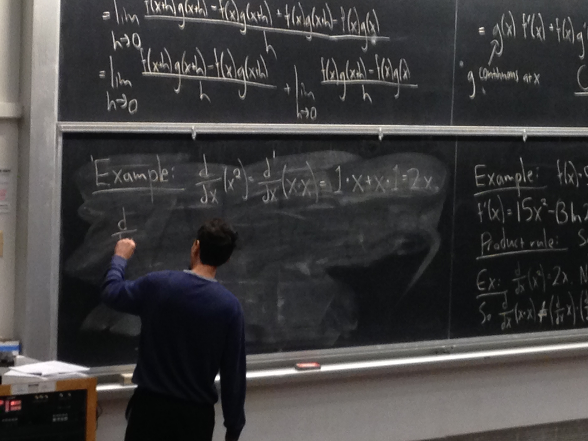

Countless times have I tried explaining why I went and finance-planned myself a BS in Statistics. The same goes for the MA in Biostatistics (except I don't have any debt from that, so no looming loan payments there!). I never have explained the "why" well, and I hope that in this blog I am able to present **the most fantastic and utterly uncalled for explanation for why I am a statistician**.

# Origin

**1. I thought engineering calculus was too hard for me, so I didn't want to be an engineer anymore.**

Would you take me seriously if I said that I once wanted to be a *chemical engineer working on renewable energy for a greener planet*? When I was in undergrad, this was my incoming freshman dream. I was going to be incredible! It didn't take me long to realize that this was not what I really wanted to do. What can I say? I was 18 years old and taking calculus for the first time from a UC Davis math professor who was also an Aikido master. That gives anyone chills. Shoutouts to <a href='https://www.math.ucdavis.edu/courses/course_detail?term=201810&select_reg_id=12529'>Dr. Brian Osserman</a> -- I can only hope to be you someday. You were great at teaching Math 21A; I just wasn't ready. *Osu*.

Now, you couldn't give someone like me a C and not expect for me to get riled up. I was this close to having a phone call with the dean about a late withdrawal from Math 21A. We resolved my feelings via email two days before the final, and I chose to power through the class. I got my the first C in my whole life in Math 21A. The next semester I enrolled in Math 16B which carried the math narrative from derivatives to integrals but condensed for majors not-so-theoretical on the math requirement. I did much better in that class and developed a knack for calculus. If you were my mom at this point, you probably would have been so annoyed. I had just said calculus was too hard for me, cried so much, then I went on and started loving it.

I spent hours nightly reading through <a href='https://www.ucdavis.edu/majors/'>all the majors UC Davis offered</a> during my first quarter. My eyes were flooded with department websites, Wikipedia pages, and not even going to lie -- Glassdoor average compensation sites. By the winter quarter, I was interested in: Nutrition BS, Exercise Science BS, and Statistics BS.

**2. I hated statistics.**

Back in high school, AP Statistics was annoying. From the start, I didn't do the homework, nor read the textbook, nor did I engage with lecture. I was most focused on writing one of my always-unfinished novels at the time. When AP exam season swung around, I was stuck with figuring out how to do statistics. I kept the Barron's AP stat review book with me at all times and studied in every single one of my high school classes. After paying attention, I understood it, and then got a 5 on the AP exam! ... And I wrote my whole exam in pen. Was I the type of high school student that would have annoyed you as a teacher? Well, I definitely would have been annoyed at myself.

I graduated high school with a 4.2 and a brain only occupied with my hobbies like music and karate. I never learned how to study. With most things just easily understood for me, I lacked focus. But I never lacked the wild dreams.

The thing that drew me into statistics in undergrad was the fact that I was actually good at it. I took the introductory statistics course on campus my second quarter to see if I could handle the subject, and to my surprise, I had a great time learning with <a href='https://biostat.ucdavis.edu/people/jie-peng'>Dr. Jie Peng</a>. I did my work as assigned, engaged with lecture, and gave the course my all. In my second semester, I got an A- and an A in statistics and math, respectively. The contrast in experience here gave me hope.

I had always been interested in science, health, and numbers ... Just never like this.

# Biostatistics

**3. My mom is a nurse.**

My mom works at this crazy extended care facility in San Francisco. When I say "crazy", please note, I. MEAN. CRAZY. Her management once described COVID as "just like the flu" and said that the pandemic was all a mental battle. While I could mock her irresponsible administration for a blog or two, my time is better spent writing about how fierce my mom's empathy is.

Despite not being paid overtime, I do not remember a time where my mom has come home on time from work. She picks up the slack of other nurses. She protects all of her patients like they are her family. She lets her patients trust her with their personal stories, has learned phrases in many languages to provide the best care, and brings them snacks they tell her they are craving on her own budget. Around Christmas, she makes sure that her patients have gifts to look forward to, wrapping up gifts like headphones in colorful gift wrap. She would mention to me of her elderly patients, "If my mom was alone, I would want someone to take care of her like this."

Everyone's superhero is their mom, but mine is *really* my mom. Her drive to do good work for those who need it most truly imbued helping others into me. Because of her, I'm empathetic too. When I found out that I could use numbers to promote health, that's when I knew what my major was going to be. It was undoubtedly going to be the stat major for me. I was going to help the nurses, the doctors, and most importantly, the patients -- somehow, some way.

**4. What is statistics without context?**

Today, I was asked where I see myself in 5 and 10 years. I didn't have a clear answer. Graduate school and the pandemic era has truly wrought out all of my plans of "becoming a data science tech bro empress" or a "biostatistics professor". As much as I could torture myself over having a better answer, I know that I have a lack of experience, and once I fill that void, my answer will be more clear.

After much meditation on where I see myself as a statistician in some years, I came up with some general goals that I'd like to accomplish within 5 years.

- Apply statistics to 100 situations effectively and responsibly

- Be mentored by 3 more experienced statisticians

- Mentor 1 incoming statistician/data scientist

- Work at the intersection of health and data science

- Use insurance data and EHR's in analyses throughout an entire project

- Develop clearer goals than these, soon

Within 10 years, my dream conquest is to work at the intersection of not just health and data science, but more specifically fitness and data science. I have struggled so much with weight throughout my life, and fitness has surpassed being a passion. I live for it. It's hard to be completely honest when you ask me what I want to do in 10 years because I'm young and ambitious. But since this is my blog, my place to be open and honest, how about some wild dreams? Let's dream on.

- Contribute to wearable technology experiements and promote fitness in people of all sizes

- Contribute to software for the emergency room to aid doctors and nurses during their shifts

- Contribute to studies regarding things like: eating disorders, women's health, racial disparities, dementia, COVID ... This list can go on.

- Teach statistics in some shape or form  

- Manage others, seriously

- Do noble, ethical, good work done that will benefit others

John Tukey said this, "The best thing about being a statistician is that you get to play in everyone's backyard." We apply statistics to many contexts. But what is statistics without context? What is it even? It's just grammar. And you can see a lot of people doing corrupt things with even good grammar. Sir Francis Galton was a eugenecist who used statistics (linear regression) to preach his beliefs. Statistics is not inherently good, but what you apply it to really can be.

In my graduate school personal statement, I closed with this:

"When it comes to life and death, doctors need to make the best decisions possible, employing their medical expertise as aided by statistical technology. The cross-disciplinary research needed to yield this type of medical technology, no matter how painstaking, will always be easier than grief that comes too soon ... As a Master’s candidate, I will thrive in three important ways. To my professors, I will be an earnest student; to my fellow students, a true ally; and to the medical field, a responsible intelligence with a heart."

Right now, I remain pretty open in what types of "good" I personally can do with data. It could be something as critical as working on reproducible statistical analyses in lab studies or something as fun as using machine learning to keep people wearing the best cropped high-waisted skinny pants. Right now, my goals are set on improving my skillset so that someday my fitness lifestyle and data science dreams merge into my career. 

# Statistics

**5. Learning and teaching statistics was one of the best rides of my life.**

Learning statistics at Davis and Berkeley were two very different but very satisfying times in my life. I went from being an directionless undergrad into being one of the most active statistics majors on campus. I collaborated with so many smart others (like my friends Patrick, Graham, Chad, Nivi, and Asem), and though I did not always know what I was doing, my projects all turned out as planned. Because of my academic training, I am definitely confident in my ability to learn new things and interact with others. If you had as much fun in stats as I did all this time, then choosing stats would be easy.

Teaching statistics at Berkeley was something I never knew I needed. Every week, I looked forward to teaching my classes. I spent lots of time rereading course material, creating my own, and enjoying the company of students who needed another explanation of how stats works. I felt pleased to have presented concepts to students in public health, theatre, drama, computer science, and more -- all of whom I hope become voices of statistical reason themselves.

It's funny to think about for me, as I breathe today's Novemeber air, that I hated statistics as a child then chose it as a career despite the headaches and struggles that accompany it. What can I say? I'm a thrill seeker.

**6. I can roll with uncertainty, but I can probably give you an answer as well.**

As I carry forth in my job search, I know that at the end of the day, I'm going to do something beneficial for others -- somewhere. And in this uncertainty, I am still trying my best to thrive and stay on top of things. I have been tutoring students in AP statistics and grad school statistics during quarantine weekly and taking on side projects to keep myself analytically busy. At this time, if you're here as a potential employer, thank you for taking the time to read this through. You didn't have to, but let me say even a bit more.

As a statistician, here is what I can do for you. If you need another explanation for why I've chosen a method, I am happy to try and give that to you. If you would rather converse in using data visualizations, please let me know what colors you would prefer and we can start right now. If you want to sit down together and clean your data, debug your impossible code, or present your work fashionably: I really got you. I'm flexible and independent, but also a reliable coworker who can make a delightfully strong cup of coffee. And while there are so many talented data wizards in the world, my strong sense of empathy and ethical responsibility makes me unique.

So, then, why? Why am I a statistician? Well, why was Kobe Bryant a basketball player? Connor McGregor, a fighter?

*Why is my mom a nurse?*

When you find something you enjoy this much, you do it. You're all in.