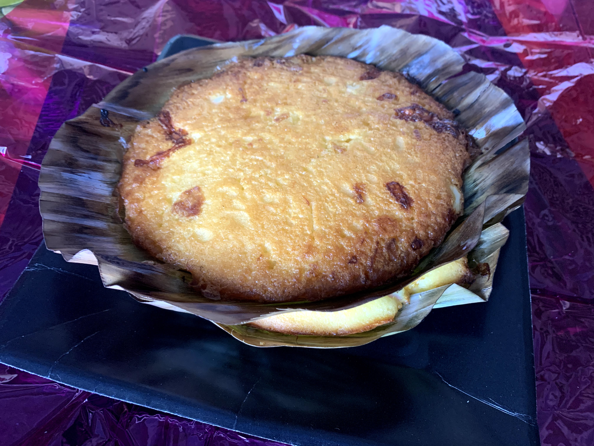

```{r, include=FALSE}
library(readr)
library(dplyr)
library(ggplot2)
library(tidyr)
library(reshape2)
library(forcats)
library(broom)
library(stringr)

christmas_music <- read_csv('christmas_billboard_data.csv')
```

Needless to say, I celebrate Christmas. What the holiday means to me over the years has deepened, but my spirits always remain "merry and bright". Some may have heard the stereotype that Filipinos start celebrating Christmas in the "-ber" months. For myself and many, this is true; I crave the decor and cheer by September. Unlike me, my mom starts celebrating after Thanksgiving. Don't you think it's a fair desire to want to be jolly and celebrate at least 6 months per year?

I'm going to use some Christmas-themed datasets to talk about some concepts. How I will choose these concepts? I'm just going to put out whatever comes to mind when I see the data on a plot.


# Do You Hear What I Hear?
I downloaded <a href='https://www.kaggle.com/sharkbait1223/billboard-top-100-christmas-carol-dataset'>some data from Kaggle on Christmas songs</a> that made it on the Billboard Top 100 throughout the years. Thanks for your contribution, <a href='https://www.kaggle.com/sharkbait1223'>Sean Gilbert</a>!

## Data
Here is a limited preview of what the dataset looks like. I've selected a random sample of 5 to show you.

```{r, messge=FALSE, warning=FALSE}
set.seed(1225)
sample_df <- christmas_music %>%
  select(song, performer, week_position, previous_week_position, weeks_on_chart) %>%
  sample_n(5)

print(sample_df)
```

The dimensions of the dataset are as follows.

```{r, warning=FALSE, message=FALSE}
christmas_music %>%
  summarize(`number of rows`=n(),
            `number of columns`=ncol(christmas_music))
```

There are 13 columns in this dataset in total. Some of them are cleaned versions of Billboard variables. For example, `weekid` was cleaned into `year`, `month`, and `day` in this dataset.

```{r, warning=FALSE, message=FALSE}
names(christmas_music)
```

Importantly, these data cover the following years only.

```{r}
christmas_music %>%
  summarize(`first christmas`=min(year), `last christmas`=max(year))
```

```{r}
christmas_music %>%
  filter(performer %in% c('Mariah Carey', 'Kelly Clarkson'))
```


## Viz
And to further ground our understanding of this dataset, let's make some visualizations.

```{r, warning=FALSE, message=FALSE}
top_instances <- christmas_music %>%
  mutate(date=as.Date(weekid, 'MM/DD/YYYY')) %>%
  group_by(performer, song) %>%
  slice_tail(n=1) %>%
  select(song, performer, instance, peak_position, weeks_on_chart, previous_week_position, week_position) %>%
  arrange(-instance) %>%
  head(10)

top_instances %>%
  ggplot(aes(x=song, y=instance)) +
  geom_bar(stat='identity', aes(fill=song)) +
  theme_classic() +
  theme(axis.text.x=element_text(angle = 90, vjust = 0.5, hjust=1),
        legend.position='none') +
  coord_flip() +
  scale_fill_manual(values=rep(c('#838B83', '#659D32'), nrow(top_instances))) +
  ylab('instances') +
  ggtitle('Christmas Songs with Most Chart Instances')
```

```{r, warning=FALSE, message=FALSE}
top_weeks <- christmas_music %>%
  mutate(date=as.Date(weekid, 'MM/DD/YYYY')) %>%
  group_by(performer, song) %>%
  slice_tail(n=1) %>%
  select(song, performer, instance, peak_position, weeks_on_chart, previous_week_position, week_position) %>%
  arrange(-weeks_on_chart) %>%
  head(10)

top_weeks %>%
  ggplot(aes(x=song, y=weeks_on_chart)) +
  geom_bar(stat='identity', aes(fill=song)) +
  theme_classic() +
  theme(axis.text.x=element_text(angle = 90, vjust = 0.5, hjust=1),
        legend.position='none') +
  coord_flip() +
  scale_fill_manual(values=rep(c('#838B83', '#659D32'), nrow(top_instances))) +
  ylab('weeks on chart') +
  ggtitle('Christmas Songs With Longest Chart Streaks')
```


```{r, warning=FALSE, message=FALSE}
year_positions <- christmas_music %>%
  mutate(date=as.Date(weekid, 'MM/DD/YYYY')) %>%
  group_by(performer, song) %>%
  slice_tail(n=1) %>%
  select(performer, song, year, week_position) %>%
  arrange(year, week_position) %>%
  group_by(year) %>%
  summarize(`mean chart position`=mean(week_position),
            count=n())

year_positions %>%
  ggplot(aes(x=year, y=count)) +
    geom_bar(stat='identity', aes(fill=`mean chart position`), width=0.3) +
    theme_classic() +
    scale_fill_gradient(low='#F0F8FF', high='#B0E0E6') +
    ylab('number of Christmas songs on chart') +
    ggtitle('Billboard Christmas Songs Per Year')
```

```{r, warning=FALSE, message=FALSE}
artists_overall <- christmas_music %>%
  group_by(performer) %>%
  summarize(count=n(),
            `first christmas`=min(year),
            `last christmas`=max(year),
            range=max(year)-min(year)) %>%
  arrange(-count) %>%
  mutate(performer=fct_reorder(performer, `first christmas`)) %>%
  head(45)

all_years <- christmas_music %>%
  pull(year)

artists_overall %>%
  ggplot(aes(x=all_years)) +
    geom_segment(aes(x=`first christmas`, xend=`last christmas`, y = performer, yend = performer, col=range)) +
  scale_color_gradient(high='#F08080', low='#8C1717') +
  theme_classic() +
  theme(legend.position='none',
        text = element_text(size=8)) +
  xlab('year') +
  ggtitle('Christmas Artists Over the Years')
```

## Regression
With this dataset, I'm going to demonstrate **linear regression** with (a) an incorrect assumption of bivariate normal and (b) ordinary least-squares. I learned a thing or two from teaching STAT2 at UC Berkeley. That's actually to say the least. While I did take probability theory many times, it was teaching introductory statistics deepened my understanding to fully harness ideas in statistics before my time in my program ran short. My boss <a href='https://www.stat.berkeley.edu/~cgk/'>Dr. Cari Kaufman</a> was the bomb. She was patient when we needed her to be, so creative with her examples, and *clear* with her expectations. Fact: When she is not teaching statistics on campus, she also is a counselor! Honestly, she would hate me for doing this, but check out her <a href='https://www.ratemyprofessors.com/ShowRatings.jsp?tid=1256749'>RateMyProfessor</a>. You can clearly tell that I'm not the only one who is a fan.

The first thing I want to do is show you some assumptions I'm breaking in this example:

- `previous_week_position` and `week_position` are not bivariate normal, so showing the correlation-based regression line will be very wrong

- outliers exist

- these data may not be linear

First off, let's see our data scattered on a plot! I chose Christmas songs that were all on the chart during December only. (January songs didn't fit into a nice line.) At first glance, it actually doesn't look awfully nonlinear. However, I do see that the data aren't tightly wound around a linear axis either. I put `previous_week_position` as the dependent variable because I'm pretty sure the previous week's chart position will affect the next.

```{r, warning=FALSE, message=FALSE}
christmas_music %>%
  filter(month==12) %>%
  filter(!is.na(previous_week_position)) %>%
  ggplot(aes(x=previous_week_position, y=week_position)) +
    geom_point(col='#CC4E5C', alpha=0.8) +
    theme_classic() +
    xlab('previous week position') +
    ylab('week position') +
    ggtitle('Scatterplot of Song Position and Previous Week Position')
```

### BVN Regression
When we talk about bivariate normal regression in STAT2, we don't say the word "bivariate normal" at all. We begin the class talking about normal distributions, then talk about having two normal distributions and letting them be on the same scatterplot.

I am going to draw two sets of random normally distributed values on a scatterplot. This scatterplot will show a "football-shaped" histogram. I'll be honest, I never really thought that the histograms ever really looked like footballs, but I did regurgitate this thought to my students.

To be clear, I am drawing random normal values from these distributions and putting them on a plot for educational purposes only.

$$
\text{Previous Week Position} \sim N(\bar{x}_\text{Previous Week Position}, \text{s}_\text{Previous Week Position})
$$

$$
\text{Week Position} \sim N(\bar{x}_\text{Week Position}, \text{s}_\text{Week Position})
$$

```{r, message=FALSE, warning=FALSE}
means_sds <- christmas_music %>%
  filter(month==12) %>%
  filter(!is.na(previous_week_position)) %>%
  select(previous_week_position, week_position) %>%
  melt(id.vars=NULL) %>%
  group_by(variable) %>%
  summarize(mean=mean(value),
            sd=sd(value))

set.seed(1225)
previous_week_norm <- rnorm(n=200, mean=means_sds$mean[1], sd=means_sds$sd[1])
week_norm <- rnorm(n=200, mean=means_sds$mean[2], sd=means_sds$sd[2])

data.frame(previous_week_norm, week_norm) %>%
  ggplot(aes(x=previous_week_norm, y=week_norm)) +
  geom_point(col='#CC4E5C', alpha=0.8) +
    theme_classic() +
    xlab('previous week position') +
    ylab('week position') +
    ggtitle('Scatterplot of BVN Song Position and Previous Week Position')
```

Our original scatterplot definitely did **not** look like this bivariate normal plot. However, I do want to cover concepts of the **standard deviation line** (SD line) and the **regression line**. Here are the formulas for those lines.


**Standard Deviation Line**  
The standard deviation line is something that I never covered in my undergrad at Davis. (Still... *Go freaking Ags!*) I definitely questioned what the point of the standard deviation line was. Well, in STAT2, we followed <a href='https://www.amazon.com/Statistics-4th-David-Freedman/dp/0393929728'>the text by Freedman, Pisani, and Purves</a>. I actually loved this textbook since I'm a visual person. I have always found texts that are quite "unorthodox" in approach to be the best ones, and this one is one of the best ones. Umm... Yeah. So, the SD line is the first prospective approach spoken about in this text to describe the relationship between your $X$ and $Y$ variables. It's supposed to be a fair idea about how to model a line through your data.

To solve for the intercept of this line, you plug in $(X,Y)=(\bar{X},\bar{Y})$, the **point of averages** of your dataset.

$$
\text{Slope}_\text{SD Line} = \frac{\sigma_Y}{\sigma_X}
\\
Y=\text{Slope}_\text{SD Line} + \text{Intercept}_\text{SD Line}
$$

To remind you, these are the summary statistics we used to simulate this bivariate normal dataset. (They are the actual sample mean and standard deviation for our December month songs.)

```{r}
sum_stats <- christmas_music %>%
  filter(month==12) %>%
  select(previous_week_position, week_position) %>%
  filter(!is.na(previous_week_position)) %>%
  gather() %>%
  group_by(key) %>%
  summarize(mean=mean(value),
            sd=sd(value))

sum_stats
```

Based on the above, we can see that our point of averages $(\bar{X},\bar{Y})=(63.95, 53.67)$ and $\text{Slope}_\text{SD Line} = \frac{\sigma_Y}{\sigma_X} = 23.04/22.71$. Here, I am using $\sigma$ and $\text{s}$ interchangeably because we simulated our data from the sample statistics.

Now, we can plug in our point of averages to calculate our SD line.

$$
53.67 = \frac{23.04}{22.71} \times 63.95 + \text{Intercept}_\text{SD Line}
$$

```{r}
slope_sd <- sum_stats$sd[2]/sum_stats$sd[1]

# Y = mX + b
# 53.67 = m63.95 + b
intercept_sd <- sum_stats$mean[1] - slope_sd*sum_stats$mean[2]

data.frame(Value=c(Slope=slope_sd, Intercept=intercept_sd))
```

Therefore, our SD line is

$$
Y = 0.99X + 11.05.
$$

```{r, message=FALSE, warning=FALSE}
data.frame(previous_week_norm, week_norm) %>%
  ggplot(aes(x=previous_week_norm, y=week_norm)) +
  geom_point(col='#CC4E5C', alpha=0.8) +
  geom_abline(intercept=intercept_sd, slope=slope_sd, col='#838B83', lwd=5, alpha=0.1) +
  theme_classic() +
  xlab('previous week position') +
  ylab('week position') +
  ggtitle('SD Line on Simulated Data')
```

**Regression Line**   
To solve for the intercept of this line, you plug in $(X,Y)=(\bar{X},\bar{Y})$, the **point of averages** of your dataset into the following formulae.

$$
\text{Slope}_\text{Regression Line} = r \times \frac{\sigma_Y}{\sigma_X}
\\
Y=\text{Slope}_\text{Regression Line} + \text{Intercept}_\text{Regression Line}
$$

The differences between the SD line and the regression line are due to the present of $r$, the correlation coefficient as a multiplier. We calculate $r$ on our simulated data using the `cor()` function.

```{r}
corr_coeff <- (data.frame(previous_week_norm, week_norm) %>% cor())[2,1]
```

The correlation between our simulated datasets is `r round(corr_coeff,4)`. This is very low which makes sense given our values above.

```{r}
slope_reg <- corr_coeff * slope_sd
intercept_reg <- sum_stats$mean[1] - slope_reg*sum_stats$mean[2]

data.frame(Value=c(Correlation=corr_coeff, Slope=slope_reg, Intercept=intercept_reg))
```

Finally, we can write out our regression line.

$$
Y = 0.08X +59.84.
$$

On our simulated data, this is what the regression line looks like. Notice how it is pulled "downward" toward the data. The regression line slope is much less steep than the standard deviation line. Since $r$ can only be as high as 1, the regression line can only be at most as steep as the standard deviation line.

```{r}
data.frame(previous_week_norm, week_norm) %>%
  ggplot(aes(x=previous_week_norm, y=week_norm)) +
  geom_point(col='#CC4E5C', alpha=0.8) +
  geom_abline(intercept=intercept_reg, slope=slope_reg, col='#659D32', lwd=4, alpha=0.1) +
  theme_classic() +
  xlab('previous week position') +
  ylab('week position') +
  ggtitle('Regression Line on Simulated Data')
```


**Visual Comparison of the Lines.**  
Which line describes the data better? You know, it has to be the regression line, but I still think they both don't look too hot because our correlation is so low. These simulated data just aren't very linear.

```{r, message=FALSE, warning=FALSE}
data.frame(previous_week_norm, week_norm) %>%
  ggplot(aes(x=previous_week_norm, y=week_norm)) +
  geom_point(col='#CC4E5C', alpha=0.8) +
  geom_abline(intercept=intercept_sd, slope=slope_sd, col='#838B83', lwd=4, alpha=0.1) +
  geom_abline(intercept=intercept_reg, slope=slope_reg, col='#659D32', lwd=4, alpha=0.1) +
  theme_classic() +
  xlab('previous week position') +
  ylab('week position') +
  ggtitle('Regression Line on Simulated Data')
```


**What if we put these lines on the original dataset?**    
Well, clearly, neither of our lines are describing our original dataset at all. This is because we were simulating two normal distributions in order to show the SD line and regression lines. When we have real datasets like the data we have plotted, we don't use the SD line and regression line in the same context as above.

```{r, message=FALSE, warning=FALSE}
christmas_music %>%
  filter(month==12) %>%
  filter(!is.na(previous_week_position)) %>%
  ggplot(aes(x=previous_week_position, y=week_position)) +
  geom_point(col='#CC4E5C', alpha=0.8) +
  geom_abline(intercept=intercept_sd, slope=slope_sd, col='#838B83', lwd=4, alpha=0.1) +
  geom_abline(intercept=intercept_reg, slope=slope_reg, col='#659D32', lwd=4, alpha=0.1) +
  theme_classic() +
  xlab('previous week position') +
  ylab('week position') +
  ggtitle('Regression Line on Simulated Data')
```


### OLS Regression
Instead of using the BVN route to regression lines, we want to use ordinary least squares regression (OLS) to compute estimates for the slope and intercept. I already wrote a <a href='https://palautatan.github.io/blogs/regression-1/regression-1.nb.html#2_defining_the_regression_line'>blog about OLS</a>, so I just want to fit the model in this one.

Here is the model created using the `lm()` function.

```{r, warning=FALSE, message=FALSE}
ols_model <- christmas_music %>%
  filter(month==12) %>%
  filter(!is.na(previous_week_position)) %>%
  lm(formula=week_position ~ previous_week_position)

ols_model %>% tidy()
```

And here is some more about the model, including $R^2$ value.

```{r}
ols_model %>% glance()
```

Here is the OLS regression line on the data.

```{r, message=FALSE, warning=FALSE}
christmas_music %>%
  filter(month==12) %>%
  filter(!is.na(previous_week_position)) %>%
  ggplot(aes(x=previous_week_position, y=week_position)) +
  geom_point(col='#CC4E5C', alpha=0.8) +
  geom_abline(intercept=ols_model$coefficients[1], slope=ols_model$coefficients[2], col='#838B83', lwd=4, alpha=0.1) +
  theme_classic() +
  xlab('previous week position') +
  ylab('week position') +
  ggtitle('Regression Line on Simulated Data')
```


```{r, message=FALSE, warning=FALSE, include=FALSE}
christmas_music %>%
  ggplot(aes(x=peak_position, y=weeks_on_chart)) +
    geom_point() +
    labs(title='Top Christmas Songs Peak Position and Weeks on Chart') +
    theme_classic()
```

# Baking Bibingka!
At Christmastime, I would always look forward to my mom's *bibingka*, a *kakanin* (rice rake) made often during this time of year in the Philippines. Bibingka has for a long time been my favorite kakanin, though I do love *suman* wrapped in palm leaves as well. My family happens to be from Central Luzon where kakanin is in abundance. A lot of my family also happens to be *Kapampangan*, descendants of the Philippines' culinary capital. Though I'm a Filipino-American who cannot speak Tagalog or any other Filipino dialects, I am **fluent in Filipino food**.

Regional recipes have stark contrasts throughout the Philippines for dishes like adobo, sinigang, or even pancit. I wondered to myself if this was also true of bibingka. (I am craving bibingka *A LOT* now that I keep typing it over and over again.)

I could have webscraped plenty of bibingka recipes online, but to my dismay, I got kicked off of AllRecipes for scraping their data once. This time, I went to 6 different websites and copied and pasted some information from the recipe pages. I've created a dataframe with some information on these recipes.

```{r}
attributes <- c('url', 'total_time', 'bake_time', 'temp', 'author', 'ingredients')

recipe_1 <- c('https://panlasangpinoy.com/rice-cake-bibingka-recipe/',
              45,
              15,
              375,
              'vanjo merano',
              '1 cup rice flour
              1/8 teaspoon salt
              2 1/2 teaspoon baking powder
              3 tablespoons butter
              1 cup granulated sugar
              1 cup coconut milk
              1/4 cup fresh milk
              1 piece salted duck egg sliced
              1/2 cup grated cheese
              3 pieces raw eggs
              Pre-cut banana leaf')


recipe_2 <- c('https://www.foxyfolksy.com/bibingka-recipe/',
              25,
              10,
              390,
              'bebs',
              '1 cup rice flour
              1/4 cup all-purpose flour
              1/2 cup sugar
              3/4 cup fresh milk
              1/4 cup water
              2 teaspoons baking powder
              1/4 teaspoon salt
              4 tablespoons vegetable oil
              1 egg
              grated cheese
              grated coconut
              1 salted egg - cut into 8 to 12 thin slices
              butter - melted at room temperature for brushing')

recipe_3 <- c('https://cooking.nytimes.com/recipes/1018391-bibingka-filipino-coconut-rice-cake',
              40,
              15,
              350,
              'nicole ponseca',
              '2 cups rice flour
              1/2 cup glutinous rice flour
              1 tablespoon baking powder
              1 teaspoon salt
              3/4 cup granulated sugar
              1/3 cup unsalted butter, melted
              1.5 cups coconut milk
              3 eggs, lightly beaten
              1 banana leaf (optional)
              1 salted duck egg, sliced (optional)
              1 cup/80 grams grated queso de bola or Cheddar cheese
              1/2 cup/52 grams grated coconut, for topping (optional)')

recipe_4 <- c('https://www.kawalingpinoy.com/bibingka/',
              35,
              22.5,
              400,
              'lalaine manalo',
              '1 teaspoon instant dry yeast
              1/4 cup warm water
              1 cup sugar
              2 cups rice flour
              1/2 teaspoon salt
              1 3/4 cups coconut milk
              2 eggs, beaten
              2 salted eggs, peeled and sliced lengthwise
              2 ounces cream cheese, sliced thinly (you can substitute kesong puti or queso de bola)
              margarine or butter, softened
              Grated mature coconut
              Sugar to taste')


recipe_5 <- c('https://www.hungryhuy.com/bibingka/',
              40,
              30,
              400,
              'huy vu',
              'banana leaves enough to line your molds
              28.35 g unsalted butter melted
              164 g white granulated sugar
              184 g coconut milk
              60 g whole milk
              170 g rice flour
              5 g baking powder
              1 g salt
              1 salted duck egg sliced into quarters
              unsweetened coconut shreds
              cheddar cheese or Velveeta shredded')

recipe_6 <- c('https://www.manilaspoon.com/2019/07/bibingka-coconut-rice-cake.html',
              35,
              20.5,
              375,
              'manila spoon',
              '8 (7-inch [17.5-cm]) banana leaves (optional, see Note), softened
              2 cups (230 g) rice flour, firmly packed
              2 tbsp (28 g) baking powder
              1⁄2 tsp salt
              4 eggs, room temperature
              1 1⁄4 cups (250 g) sugar
              1 (13.5-oz [400-ml]) can coconut milk
              2 tbsp (28 g) unsalted butter, melted
              1 tsp vanilla extract')

bibingka_recipes <- list(recipe_1, recipe_2, recipe_3, recipe_4, recipe_5, recipe_6)

for (ix in 1:length(bibingka_recipes)) {
  names(bibingka_recipes[[ix]]) <- attributes
}


bibingka_df <- data.frame(Reduce(rbind, bibingka_recipes))
row.names(bibingka_df) <- 1:nrow(bibingka_df)

bibingka_df %>% select(-url)
```

Bibingka is made with rice flour, sugar, coconut milk, butter, eggs, and salt. The type of leavener seems to vary according to these recipes.


## Flour
I am combining rice flour with any AP flour or glutinous rice flour in this analysis. Clearly, the addition of other flours affects not only texture but the way the kakanin bakes. However, I'm going to consider the amounts of the other flours to simply be just more "starch" for this analysis.

```{r}
flour_components <- vector(mode='list', length=6)

for (ix in 1:6) {
  these_ingredients <- unlist(strsplit(bibingka_df$ingredients[ix], split='\n'))
  these_ingredients <- sapply(these_ingredients, trimws)
  flour_component   <- these_ingredients[grepl(x=these_ingredients, pattern='flour')]
  
  flour_components[[ix]] <- flour_component
}

# CONVERT GRAMS TO CUPS
# ACCORDING TO https://www.annaolson.ca/baking-conversions
# RICE FLOUR 1 cup = 135 g
g_index <- which(abs(grepl(x=flour_components, pattern='[0-9] cup(s?)') - 1)==1)
gtocups <- flour_components[g_index]


flour_components[[g_index]] <- paste0(round(as.numeric(str_extract(gtocups, '[0-9]+'))/135, 4), ' cups rice flour')

rice_flour_amounts <- list()
for (ix in 1:6) {
  these_vals <- str_extract(flour_components[[ix]], '[0-9]+(.[0-9]+)?')
  
  if(any(grepl('/', these_vals))) {
    these_vals[which(grepl('/', these_vals))] <- eval(parse(text=these_vals[which(grepl('/', these_vals))]))
  }
  
  rice_flour_amounts[[ix]] <- sum(as.numeric(these_vals))
}

bibingka_df$flour <- unlist(rice_flour_amounts)
```

```{r}
bibingka_df[,c('flour')]
```


## Sugar
The following code parses out sugar.

```{r}
# https://www.google.com/search?q=how+many+g+of+sugar+is+1+cup&oq=how+many+g+of+sugar+is+1+cup&aqs=chrome..69i57.4438j0j1&sourceid=chrome&ie=UTF-8

this_pattern <- 'sugar'
this_conversion <- 201
ingredient_components <- vector(mode='list', length=6)

# ix <- 4
for (ix in 1:6) {
  these_ingredients <- unlist(strsplit(bibingka_df$ingredients[ix], split='\n'))
  these_ingredients <- sapply(these_ingredients, trimws)
  components   <- these_ingredients[grepl(x=these_ingredients, pattern=this_pattern)]
  
  components <- gsub(pattern='⁄', replacement='/', components)
  
  # PARENTHESIS
  if (any(grepl(pattern='\\(', x=components))) {
    paren_ix <- which(grepl(pattern=' \\([0-9]+ [A-z]+\\)', x=components))
    components[paren_ix] <- gsub(pattern=' \\([0-9]+ [A-z]+\\)', replacement='', x=components[paren_ix])
  }
  
  # CONVERSION
  # Check that all contain ingredient measurements contain "cups".
  if (!any(grepl(pattern='[0-9] cup(s?)', x=components))) {
    
    if (grepl(pattern='[0-9]+ g(rams)?', x=components)) {
      gram_index <- which(grepl(pattern='[0-9]+ g(rams)?', x=components))
      converted_cups <- round(as.numeric(str_extract(components[gram_index], '[0-9]+'))/this_conversion, 4)
      components[gram_index] <- converted_cups
    }
    
  }
  
  # EXTRACT VALUE ONLY
  # try_these <- c('1/2', '1', '1 1/2', '1.2')
  
  whole_number <- str_extract(components, pattern='^[0-9]+(\\.[0-9]+)?( |$)') # Or decimal.
  fraction     <- str_extract(components, pattern='[0-9]/[0-9]')
  # There is a weird character here.
  
  # EVALUATE FRACTIONS
  if (!is.na(fraction)) {
    fraction <- as.numeric(eval(parse(text=fraction)))
    
    if (!is.na(whole_number)) {
      value_only <- as.numeric(whole_number) + fraction
    } else {
      value_only <- fraction
    }
    
  } else {
    value_only <- whole_number
  }
  
  ingredient_components[[ix]] <- trimws(value_only)
}

bibingka_df$sugar <- unlist(ingredient_components)
```

```{r}
bibingka_df[,c('flour', 'sugar')]
```

## Milk
This code will classify coconut (or evaporated or some sort of milk alternative) milk and milk as the same entity. I chose to do this because they would act quite similarly in the baking of bibingka.


```{r}
# Via CHAOKOH nutrition facts
# 1/3 cup = 80 mL
# 1 cup = 240 mL/g

this_pattern <- 'milk'
this_conversion <- 240
ingredient_components <- vector(mode='list', length=6)

# ix <- 2
for (ix in 1:6) {
  these_ingredients <- unlist(strsplit(bibingka_df$ingredients[ix], split='\n'))
  these_ingredients <- sapply(these_ingredients, trimws)
  components   <- these_ingredients[grepl(x=these_ingredients, pattern=this_pattern)]
  
  components <- gsub(pattern='⁄', replacement='/', components)
  
  # REMOVAL OF PARENTHESIS
  if (any(grepl(pattern='\\(', x=components))) {
    paren_ix <- which(grepl(pattern=' \\([0-9]+ [A-z]+\\)', x=components))
    components[paren_ix] <- gsub(pattern=' \\([0-9]+ [A-z]+\\)', replacement='', x=components[paren_ix])
  }
  
  # CONVERSION
  # Check that all contain ingredient measurements contain "cups".
  if (!any(grepl(pattern='[0-9] cup(s?)', x=components))) {
    
    if (any(grepl(pattern='[0-9]+ g(rams)?', x=components))) {
      gram_index <- which(grepl(pattern='[0-9]+ g(rams)?', x=components))
      converted_cups <- round(as.numeric(str_extract(components[gram_index], '[0-9]+'))/this_conversion, 4)
      components[gram_index] <- converted_cups
    }
    
  }
  
  # EXTRACT VALUE ONLY
  # try_these <- c('1/2', '1', '1 1/2', '1.2')
  
  whole_number <- str_extract(components, pattern='^[0-9]+(\\.[0-9]+)?( |$)') # Or decimal.
  fraction     <- str_extract(components, pattern='[0-9]/[0-9]')
  
  # REMOVE NA'S IN WHOLE NUMBER
  if (length(whole_number)>0) {
    if (any(is.na(whole_number))) {
      whole_number <- whole_number[!is.na(whole_number)]
    }
  }

  # REMOVE NA'S IN FRACTION
  if (length(fraction)>0) {
    if (any(is.na(fraction))) {
      fraction     <- fraction[!is.na(fraction)]
    }
  }

  
  # EVALUATE FRACTIONS
  
  # If there exists a fraction,
  if (length(fraction)>0) {
    
    # Evaluate it.
    fraction <- as.numeric(eval(parse(text=fraction)))
    
    # If twas a mixed number,
    if (length(whole_number)>0) {
      
      # add the whole and fraction parts together.
      value_only <- as.numeric(whole_number) + fraction
    } else {
      
      # Else, it's just the fraction that will be our value.
      value_only <- fraction
    }
  
  # Otherwise if there are no fractions,
  } else {
    
    # Use the whole number only.
    if (length(whole_number)>0) {
      value_only <- whole_number
    }
    
  }
  
  
  if (length(value_only)>1) {
    value_only <- sum(as.numeric(value_only))
  }
  
  ingredient_components[[ix]] <- trimws(value_only)
}

bibingka_df$milk <- unlist(ingredient_components)
```

```{r}
bibingka_df[,c('flour', 'sugar', 'milk')]
```

## Butter/Oil
At this point, I realized that I needed some checks against what kind of units I would allow. A lot of the recipes were working with tablespoons. We had some cups and of course the 5th recipe was in grams. I had a lot of ideas to continue this project, and it may seem quite odd to even be posting unfinished progress on my blog, but I think this one was worth the archive... Here is the final dataframe I had.

```{r}
bibingka_df
```

These were my notes that I ended with.

## Final Notes
You know, I need to do better planning of my function.

- Function inputs
  - String to parse
  - Ingredient to look for (regex pattern)
  - Conversion from g to cups
- Function returns
  - Measurement in cups
  
As much as I'd like to finish this project once and for all, it truly is Christmastime. It is not last year's Christmas or the year before that's. No Christmas is the same, and 2020's Christmas is still going to be warm and loving for me. I'm off to spend time with my mom in the kitchen to *actually* bake some bibingka listening to the Christmas hits discussed earlier... I'm blessed.




```{r, include=FALSE}
# https://www.allrecipes.com/article/cup-to-gram-conversions/


possible_units <- c('tablespoon(s)?',
                    'tbsp',
                    'cup(s)?',
                    'g',
                    'gram(s)?')

ingredient <- bibingka_df$ingredients[5]

parse_ingredients <- function(ingredient, this_pattern, conversion) {
  
  these_ingredients <- unlist(strsplit(ingredient, split='\n'))
  these_ingredients <- sapply(these_ingredients, trimws)
  components   <- these_ingredients[grepl(x=these_ingredients, pattern=this_pattern)]
  
  components <- gsub(pattern='⁄', replacement='/', components)
  
  if (!grepl('[0-9]', components)) {
    return(0)
  }
  
  
  # REMOVAL OF PARENTHESIS
  if (any(grepl(pattern='\\(', x=components))) {
    paren_ix <- which(grepl(pattern=' \\([0-9]+ [A-z]+\\)', x=components))
    components[paren_ix] <- gsub(pattern=' \\([0-9]+ [A-z]+\\)', replacement='', x=components[paren_ix])
  }
  
  
  # UNITS
  find_units <- sapply(possible_units, function(k) grepl(pattern=k, x=components))
  these_units <- possible_units[which(find_units)]
  
  # CONVERSION
  # Check that all contain ingredient measurements contain "cups".
  if (!any(grepl(pattern='[0-9] cup(s?)', x=components))) {
    
    if (any(grepl(pattern='[0-9]+ g(rams)?', x=components))) {
      gram_index <- which(grepl(pattern='[0-9]+ g(rams)?', x=components))
      converted_cups <- round(as.numeric(str_extract(components[gram_index], '[0-9]+'))/this_conversion, 4)
      components[gram_index] <- converted_cups
    }
    
  }
  
  # EXTRACT VALUE ONLY
  
  whole_number <- str_extract(components, pattern='^[0-9]+(\\.[0-9]+)?( |$)') # Or decimal.
  fraction     <- str_extract(components, pattern='[0-9]/[0-9]')
  
  # REMOVE NA'S IN WHOLE NUMBER
  if (length(whole_number)>0) {
    if (any(is.na(whole_number))) {
      whole_number <- whole_number[!is.na(whole_number)]
    }
  }

  # REMOVE NA'S IN FRACTION
  if (length(fraction)>0) {
    if (any(is.na(fraction))) {
      fraction     <- fraction[!is.na(fraction)]
    }
  }

  
  # EVALUATE FRACTIONS
  
  # If there exists a fraction,
  if (length(fraction)>0) {
    
    # Evaluate it.
    fraction <- as.numeric(eval(parse(text=fraction)))
    
    # If twas a mixed number,
    if (length(whole_number)>0) {
      
      # add the whole and fraction parts together.
      value_only <- as.numeric(whole_number) + fraction
    } else {
      
      # Else, it's just the fraction that will be our value.
      value_only <- fraction
    }
  
  # Otherwise if there are no fractions,
  } else {
    
    # Use the whole number only.
    if (length(whole_number)>0) {
      value_only <- whole_number
    }
    
  }
  
  
  if (length(value_only)>1) {
    value_only <- sum(as.numeric(value_only))
  }
  
  return(list(components, these_units, trimws(value_only)))
  
}


this_pattern <- 'butter|oil'
this_conversion <- 227
ingredient_components <- vector(mode='list', length=6)

rawr <- lapply(1:6, function(k) parse_ingredients(ingredient=bibingka_df$ingredients[k], this_pattern='butter|oil', conversion=227))

bibingka_df$butter <- unlist(ingredient_components)
```
