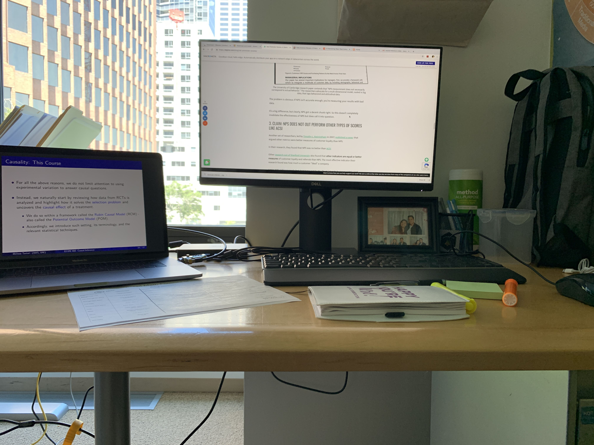

COVID-19 has been a wrecking ball. Lives have been lost, and dreams have been delayed. It's scary and humbling to be living during this time, but the efforts on behalf of Californians have been tremendous. I am thankful to be surrounded by thoughtful folks when faced with this invisible and lethal terror. One unexpected change that I've faced during this time period was losing my full-time offer as Data Scientist at Gap, Inc. The excitement I had of starting my career on San Francisco's Folsom Street seems pretty distant now, but what I learned there is still fresh.

It's been more than a year since I left my Gap internship and three months since I graduated from Cal. Time has gone by so fast, and it certainly has been a while since my blog received any love from me. This particular blog has been in the making for a while with small additions here and there since the start of my last school year at Cal. What I hope is to bring to light the contrast between the work environment and academia for those who are living at the border between them right now.

_____________________________________________________________

When I wrote my cover letter to the Gap recruitment team, I pondered the ways I could put the techniques I learned in class to the test in the real world. Was I finally going to use my years-earned regression knowledge in a useful scenario? Maybe I would try a couple of clustering techniques for whatever reason. All of these ideas were but a reach. I did however end up using my regression knowledge and clustering during some exploratory analyses.

On June 17th, 2019, I was so scared of meeting my fellow interns at 2 Folsom, but I put my brave face on. There was a group of about 40 of us all with different backgounds. We were assigned to work with assorted teams around the company for the summer. Four of us were data science interns, and two of which (Anni and Ashley) I was able to work with all summer. Ashley, Anni, and I couldn't have been a better fit for each other as the "data boys". We spent around 40 hours per week sitting in the same room as each other for 10 weeks. Is there a better way to bond quickly? Ashley at the time was an undergraduate statistics student at Cal Poly SLO who was incredible at databases and well-versed in machine learning techniques. Anni, an undergraduate student from University of Washington, double majored in mathematics and economics. You couldn't tell that she wasn't a statistics major. Both Ashley and Anni taught me so much, as well as learned the data science ropes along with me in our first internships.

By summer's end, I found myself thinking oppositely from how I'd been when writing my cover letter. How was I going to apply all the things I learned at Gap to my final year at Berkeley? My undergrad introduced me to statistics broadly, and my grad school education had elevated me to my so-far intellectual best. To my surprise, my internship caught me off-guard with how rich one month could be. I learned the data science tools that only experience could get you.

I compiled a list of tips that would've helped me as I began my internship. Here's a photo of a bunch of some of the interns and our incredible recruiter, David McKenna.

# Tips

## Appearances matter.
Upon reading this, I antipcate a few: "I work in tech. Appearances don't matter. I'm coming to work in sweats!" While it may be commonplace to dress extra comfortably in tech, appearances really do matter. From a shallow perspective, you are always being evaluated in some way. It's not just about the way you dress, though it can help, but more in the way you carry yourself. Other than being clean and appropriately dressed, wearing what makes you feel most confident will amplify even the best of your first impressions. Looking "good" is important. A couple notes I took on BART and at the Gap:

- A clean face looks good on everyone.  
- Everyone has their own style. Revel in what you think looks good, but make sure your clothes fit as intended.  
- Tech bros love Allbirds.  
- Gap employees will stunt TF on you with Gucci, Commes de Garcones, Louis, and more...  

Appearing "busy" is also just as important as looking your best. When I worked in a science lab, it was normal for us to kick off my shoes and read up on semi-related material if I was running automated analyses. I surely did not kick off my shoes at the Gap, but I did have funny friends. Being seen as interns chatting most of the time, it was difficult for management to give us benefit of the doubt when some of our project plans were delayed. Part of our intern process was showing your employers we could behave professionally, especially since we wanted the opportunity transition to full-time. One of the full-time data scientists I met told my friends and I that at her previous job, when she knew that she had a long-term project, she would make sure she visibly picked up  (visibly to her higher ups) other small projects to look and stay busy.

## You need to produce lots of summary stats.
So, you are finishing up a degree in statistics, computer science, or math, and you have learned all your machine learning ABC's. At your internship you will be wanting to utilize your ANOVA, BNN, and CV to come up with novel results. That's not all you'll do. In fact, that's not even the half you'll do. As an intern in data science, I really needed 3 letters in the alphabet. S, Q, and L. And you're going to want to switch back to chapter 1 of your stats textbooks. Spending all your time on summary statistics may be basic, it is incredibly important.

Since I was working with data queried from SQL databases all summer, summary statistics served as a measure of validity. For example, if you query your data for a complicated analysis on clothing demand, you're going to want to know what the average unit prices are based on your data and based on what what may be commonplace knowledge to experienced colleagues. You don't want to look over details that can heavily sway your final estimates, and you will want to incorporate (validate) what others in the building already know.

## Your data will be annoying.
Depending on where you work, you will have different amounts of data available to you. At the Gap, there was definitely a bunch. This doesn't always mean that because you have a bunch of data that the data will be in the best format for you to answer your question. In fact, data can come in many forms: completely unstructured (in which case you will have to clean it) or too structured (where you'll have to go digging and figure out what the heck happened to your data before it got to you.) If you have access to the way your data were generated, you're in luck. If you don't have an idea, then good luck, Sherlock.

During my internship, I worked with survey data. My fellow data boy, Ashley, grabbed a bunch of the data we were looking for off of servers, which we all later cleaned. It took approximately 7.5 out of 10 weeks for us to understand our dataset. Building a cohesive project around it took about 1.5 weeks. It'd be hard to describe our full data struggle, but to summarize:

- First, we had no data.  
- Then, we had some data, but after plenty of work, found out it was not the correct dataset.  
- Next, we were in a data drought;  we tried to connect in-house database with contracting company's database (~6 weeks).    
- Finally, we had data, worked super hard to clean it and analyze it responsibly, conquering our inner and outer demons.    
- During modelling, using `na.omit()` killed more than half of our data.    

But after all that, we came out of the internship with a squeaky clean dataset, *PLUS* documentation, thanks to my second fellow data boy, Anni. It wouldn't have been possible if not for lots and lots of asking the right questions to track down where the data may have been. It was not the funnest game of hide-and-seek!

## Computers are not THAT fast. Your code can help.
We coded mainly in `R` (sometimes we coded in Python). If there's anything you should remember about `R` is that it can use up a lot of memory. 

Prior to internship, I wasn't that experienced in using clusters/servers. With a dataset of about 1.5 million records, I managed to use an odd combination of command line, base R, and Tidyverse functions. If I could tell myself now from what I've learned from the statistical computing class, then I would inform myself of the following:

- R makes a lot a lot a lot of object copies, so avoid them at all costs when working with a dataset that big. Some helpful functions would be `gc()` or `.Internal(inspect(x))` before committing to code in pipelines.     
- Try to use C code to go through and filter your data. The `awk`, `sed`, and `grep` functions are all helpful.    
- Packages like `doParallel` and `foreach` can help distribute your code and keep it streamline.

I think there are many ways to make your code faster, but what will matter most are the resources you have when you're at work. I would also caution about server traffic. If you have something huge you need to run, run it overnight so you get shorter wait times while you're physically at the office. (RIP, when is anyone going to be back at the office?)

## Presentations to business partners will lose lots of technicalities. Keep an appendix.
Punch lines and the long story short. My friends and I presented our data science project that way. Truth be told, I love myself an intentionally sharp and business-focused presentation. I prefer to be understood rather than confuse others with my ANN, ML, CNN, RF, ABC, TLDR. But it never occurred to me how punishing it might be to not display all your technical hard work. I really don't know why. Probably because I'm an entertainer at heart. 

Matter of fact, your presentation will be shy of a reflection of your hard work. What it really will be is a translation of your hard work into impactful business statements. Not one is more valuable than the other. So take your hard work. Set the stage with your data science as the backdrop. When you're up there presenting, hit the important business concerns. If anyone has a technical question, flip over to your slide appendix which you can fill with lots and lots of code, plots, and all that shiny good stuff.

## As a data scientist, you will have your admirers and your haters.
ML, AI, and big data are all hot words. Isn't that why you wanted to become a data scientist anyway? Well, for me -- yeah, probably. I give into hype. But I stuck around right? So #6 seems a little obvious, but I think it's a point that was really important for me to drive home.

So, your colleagues will use data-centric words. They will talk about making data-driven decisions. ... Yes, even your nontechnical colleagues. Some of them will be absolutely fantastic and know what they're talking about. You won't have to explain to them the importance of what you're doing because "queens recognize queens".

Other colleagues will not understand your work. Some will discount it and ask question why it even takes you so long to do it. This is not okay! "Data science" is a new term for a lot of old concepts melded together to solve modern problems. A lot of people will not know that or respect it. But they don't know how hard you work. And you don't need to go out of your way to prove to them your worth. But do assert you're valuable and worthy of respect.

I'm not sure who you were imagining when I spoke of "colleagues", but I want you to imagine now. A colleague could be someone from another department who simply doesn't know what you do. A colleague could even be a coworker in your department. But imagine this for a second. Imagine this colleague to be a senior director of another department. Or someone C-level. At all levels of the workplace, you may find this type of apathy toward your field.

... And appreciation. You will find so much appreciation for your amazing work. Data science does wonders.

## Do your write ups. Daily.  

My friends and I took up our boss Dan Driscoll's office the whole summer. It was nice to have that level of privacy as a newcomer, especially when we were dazed and confused. Every so often, Dan would walk in and ask us what we were up to. We soon learned that at any point in time, some part of our work had to be ready to show. Only you know exactly what you've learned, so write down your discoveries as you go. I prefer writing up `R` notebooks and making graphical summaries on Keynote (Apple's Powerpoint... I much prefer).

Pro-tip: At the end of each day, make sure you've written up your work so it is reproducible. Be able to click 'Run' on your script, and make sure it runs without errors. As a reference to #1, having your work packaged up like this shows that you have always done something.

## Your higher ups have done your job before (hopefully). Take advantage of that.
One of our Gap data science bosses, Chris Chapo, was quite the genius with a crunch for time. (I say this super respectfully, trust me.) We met with him several times during our internship to discuss our project progress. It was a scary feeling, really, to be a meager intern and presenting project goals/thoughts to someone so pivotal to the company. I had to get over the imposter syndrome and focus on adding value to the time that Chris Chapo set aside for my partners and me.

Before going into our meetings, Ashley, Anni, and I always got on the same page on what we were going to focus on. I unintentionally played timekeeper in the meeting. We had the most important questions written out and allotted appropriate time to each. Watching Chris whiteboard and show us how he would approach a lot of the problems we faced was really eye-opening. He explained simple solutions to complex problems. And hated writing in red marker.

When Dan would walk in to our office, we would ask so many questions. He always had a really good answer. One of my favorite chats with Dan was about using demographic information in marketing data science. We didn't come to a consensus within the room, but having these discussions with our higher ups really gave me perspective. It also gave me perspective to know that Dan did all of his data science coding in C ... Wow.

_____________________________________________________________

It's so important to remember that though you can be the smartest student in school, being able to listen (soft skill) and being able to adapt (soft skill) are the most important things to flex in the workplace. Your technicalities will shine through regardless. Flash forward a year from being part of Gap Interns 2019, Ashley has no graduated from Cal Poly, SLO in Statistics and is a data science intern in for a startup in So Cal. Anni graduated from UW and is now starting off her PhD in statistics at Carnegie Mellon. I couldn't be more proud of those two data boys. I feel like our summer together was incredible, and when I say we went through so much together, we really did. Thanks, Ashley and Anni. And Subha, Gianna, and Caity (our summer FTE buddies). Anni drew this of us.

As for me, I'm still looking for the right placement. It sucked getting rescinded, but I'm really hopeful that wherever I go next, I'll find many positive learning experiences.