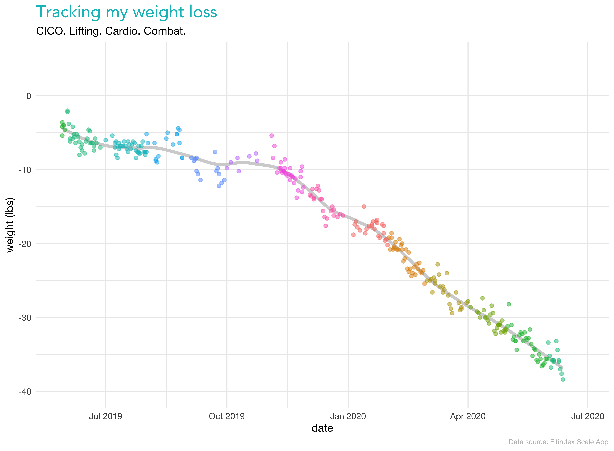
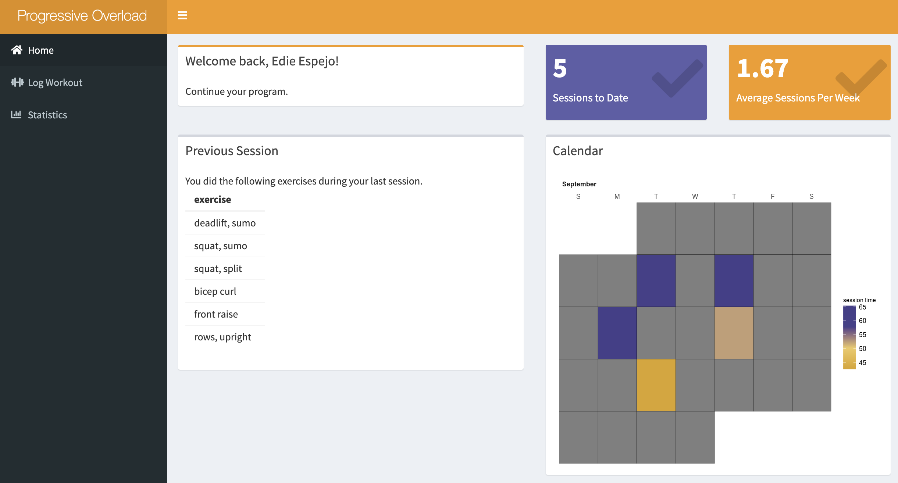
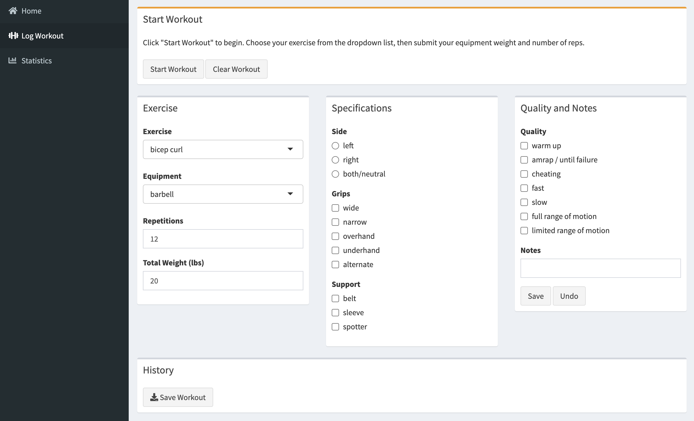
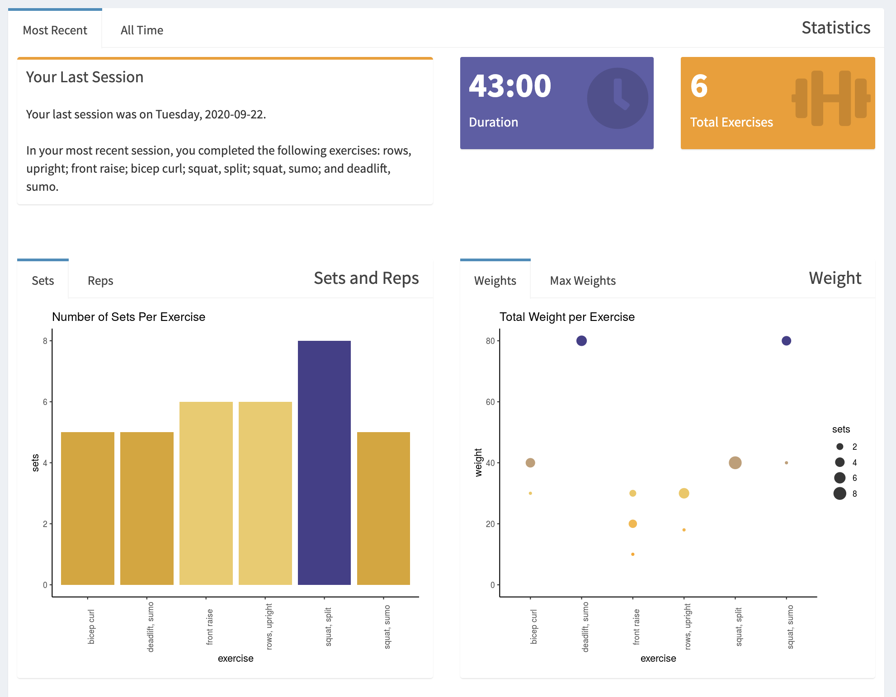

# A Quarantine Body
In my final semester at Berkeley, I took a class from <a href='https://www.stat.berkeley.edu/~aditya/'>Dr. Aditya Guntuboyina</a> on multivariate time series. Despite being bewildered by vector autoregressive model theory and the long equations coupled with it, the course proved to me a second time how powerful time series is. Funny enough, this blog is not about time series. I just wanted to point something out that I noticed during my final presentation for that course.

I did my <a href='https://github.com/palautatan/weight-loss-trends'>final project</a> on weight loss search terms. *Why?* Because I'm passionate about fitness, and I've been working on cutting my weight and shaping my body for a year now. I focused on three Google search terms relevant to "weight loss". Here is a time series plot of the standardized Google search values for "diet for weight loss", "exercise for weight loss", and "pill for weight loss" over the past 12 months.

```{r}
google_trends <- readr::read_csv('multiTimeline.csv', skip=2)
names(google_trends)[2:4] <- c('diet', 'exercise', 'pill')
google_trends <- google_trends %>% reshape2::melt(id.vars='Week')

google_trends %>%
  ggplot2::ggplot(aes(x=Week, y=value, group=variable)) +
    geom_point(aes(col=variable)) +
    geom_line() +
    ylab('standardized search value') +
    ggtitle('Search Trends "for Weight Loss"') +
    theme_minimal() +
    scale_color_manual(values=c('sienna2', 'slateblue', 'goldenrod2'))
```

Where I'm from, shelter in place began on March 16th, 2020. It shockingly has been more than six months since then. The astonishment that I felt at the time turned into anxiety toward my family and my nurse mom. In April, I cancelled my birthday plans and became worried sick as several members of my family fell sick to COVID-19. My nurse auntie in particular was in the ICU for weeks and is still recovering. In May, I graduated at home. By June, I had lost my job placement, and by July, my grandma left the world without us by her side. My ability to complete job applications and data science projects at all has been a blessing.

What's kept my stress levels in check has primarily been my dedication to fitness. By the time series plot above, we see morale toward weight loss searches dropped incredibly right late March 2020. A few weeks later, the world picked back up into a surge mid-April. While not pictured here, there is not normally a search surge in April that high. Hashtags like "#QuarantineBod" have become popular. Our bodies have certainly undergone changes during this time period of being offput and suffering from COVID-19.  Years from now I will remember how important fitness became to me for offloading stress. And since we're talking about it, I may as well show you my weight loss graph from January until June.

```{r}

```

Since I made this graph, I've had a bit of trouble with  aweight loss plateau. This is due to a number of things, but one of which is that at my petite height, it's hard to drop anything more than half a pound per week. I started incorporating more weightlifting starting in March, and now, most of my fitness victories are non-scale. I wanted a way to represent that through data. <a href='https://palautatan.shinyapps.io/overload-app/'>Overload </a> was the way I came up with.

# What is Progressive Overload?
When you strength train, you have many choices to make. One of which is how you'd like to present your body with progressive overload. That is: making your strength training exercises harder so that you may become stronger. You can increase the weight, the amount of reps, or even decrease the amount of time between your training sets.

# Overload App
I was on the market really to find a simple weight lifting app. I didn't want an app to fully structure my workout *because I wanted to be making my choices based on the data, not the reverse*. Therefore, I opted for a dashboard that would create easy-to-use data files for many visualization purposes.

When you load up Overload on your browser, you will see *my* strength training progress. On the front page of the dashboard, you can see what I did in my previous session, how many minutes I worked on on the month calendar, and two session metrics.

```{r}

```

Logging workouts is easy. You click *Start Workout*, and then you can build up your history with the available drop downs and check boxes. When you're done, you can save your workout to CSV.

```{r}

```

Finally, you can see statistics about your most recent session or view all-time records. The statistics tab is the main driver in how I structure my next workout. Other than looking at my data, of course, I'll be tuning into my body and carefully picking which muscle group I work next.

```{r}

```

Currently, <a href='https://palautatan.shinyapps.io/overload-app/'>Overload </a> is only available to myself. That's because I don't have the funds to put other users on my server! But of course, you can check out *my* workout progress and how Overload changes as time goes on.