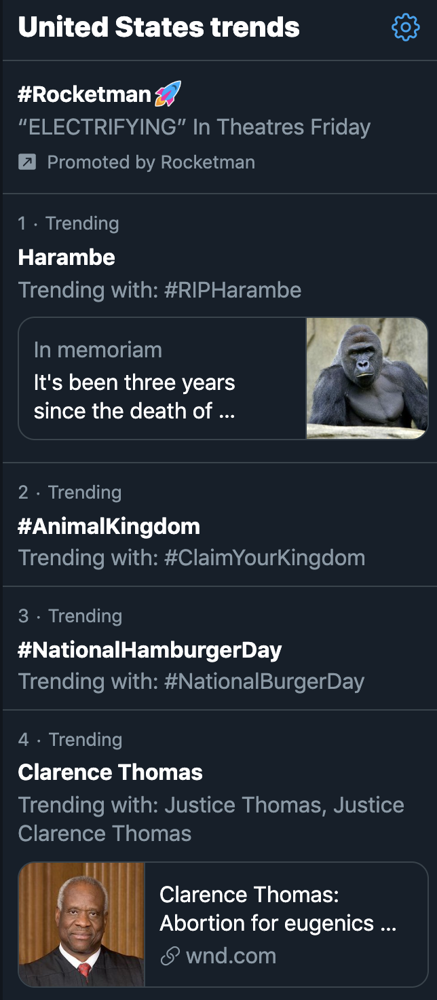

```{r setup, include=FALSE}
knitr::opts_chunk$set(echo=FALSE)
```

```{r libraries}
library(readr)
library(ggplot2)
library(dplyr)
library(scales)
library(reshape2)
```

```{r data-load, include=FALSE}
nasdaq <- read_csv("../../data/nasdaq-history.csv")
```

```{r nasdaq-plot}
nasdaq <- nasdaq[-1,]
nasdaq <- nasdaq %>% mutate(date=as.Date(nasdaq$date)) %>%
  dplyr::select(-volume)

nasdaq <- nasdaq %>% mutate(average=(close+open+high+low)/4)

nasdaq_long <- nasdaq %>% melt(id.vars="date")

ggplot(nasdaq_long) +
  geom_point(aes(x=date, y=value, group=variable, color=variable), alpha=0.7) +
  geom_segment(data=nasdaq, aes(x=date, xend=date, y=low, yend=high), alpha=0.3) + 
  geom_line(data=nasdaq, aes(x=date, y=average), lwd=1, col="darkred") +
  ylab("NASDAQ") +
  ggtitle("Nasdaq Stock Market Index (28-APR-2019 TO 28-MAY-2019)") +
  theme_minimal() +
  scale_colour_brewer(palette="Reds")
```

If you're partial to watching the news on television, the NASDAQ stock market index is a natural sight. The y-axis in the plot above represents a "snapshot" stock market performance and the x-axis is time. The data presented in the plot are a "time series" because they are repeated measurements taken over a time period. The data above were downloaded from the Nasdaq website and cover a month period from the end of April to the end of May. Over this period, the index peaked on the 24th of May.

<p>


If you prefer personalizing your periodicals on Twitter over watching the news, you are familiar with the concept of "trending". While no time series plots are visible to Twitter users, data scientists use time series trends to determine which hashtags are the most popular according to your account preferences. 

By default, Twitter accounts show personalized trends on the homepage. That is, the trends you see take into account your location and who you follow to show you what is important to you. (Which has some dangerous aftermath, but this thought experiment will be left as exercise to the reader.) 

The figure to the right is a screenshot of US trends from the 28th of May. The US Twitter community celebrated the life of Harambe three years after his passing and the #AnimalKingdom. In fourth place after National Hamburger Day, Justice Clarence Thomas was trending for his "bizarre attack on birth control" associating abortions with racial eugenics.

Reflecting Twitter's fast-paced stream, the countrywide trends changed completely by the next day.
</p>

# Why time series?
Stock market averages are tracked and predicted by time series analysis to keep investors well-informed. Twitter users keep up-to-date with their cyberworld using trending hashtags detected by time series algorithms. Population figures, monthly airline passengers, and temperature can also be represented by time series data to equip the city for an influx of new citizens, to use airline resources efficiently, and to reveal effects of global warming.

We use **time series analysis** to describe and predict the relationship between our observations through time.

# Statistically speaking
**Time series** is a branch of statistics that deals with temporal data and is also the name for those data. We analyze time series using time series. (That sounds rather unhelpful!) The Nasdaq data we visualized above is an example of a **time series plot**.

A **time series** (*type of data*) can be denoted as $\{x_t\} = \{x_1, x_2, ..., x_t\}$ where the $x$'s are observations and the indices represent their temporal order.

A **time series model** of these data is a joint distribution for the random variables $\{X_t\} = \{X_1, X_2, ..., X_t\}$ that would give rise to our data $\{x_t\}$.

The **classical decomposition model** rewrites the time series model $\{X_t\}$ in three components: trend ($m_t$), seasonality ($s_t$), and random noise ($Y_t$). We can write the model as an addition between the three components as follows:

$$
X_t = m_t + s_t + Y_t.
$$

The model assumes that the components have an additive relationship (a log transformation must be taken when the relationship is multiplicative). Our goal is to subtract trend and seasonality from our data and examine the noise component $Y_t$.


# How to properly time travel


# References

Hom, Elaine J. "What is NASDAQ?". (2012.) [<a href="https://www.businessnewsdaily.com/3403-nasdaq.html">URL</a>]

Lotan, Gilad. "#FreddieGray -- is not trending on Twitter?" (2015.) [<a href="https://medium.com/i-data/freddiegray-is-not-trending-on-twitter-9e4550607a39">URL</a>]

Millheiser, Ian. "Justice Thomas launches an utterly bizarre attack on birth control". (2019.)
[<a href="https://thinkprogress.org/justice-thomas-launches-an-utterly-bizarre-attack-on-birth-control-195921bb7781/">URL</a>]

Needle, Sarah. "How Does Twitter Decide What Is Trending?". (2016.) [<a href="https://rethinkmedia.org/blog/how-does-twitter-decide-what-trending">URL</a>]

Stirling, Doug. "CAST". [<a href="http://www-ist.massey.ac.nz/dstirlin/CAST/CAST/Hmultiplicative/multiplicative1.html">URL</a>]

# Data Sources

Nasdaq Historical Quote Download. [<a href="https://www.nasdaq.com/symbol/csv/historical">URL</a>]

```{r}
nasdaq %>% arrange(date)
```

