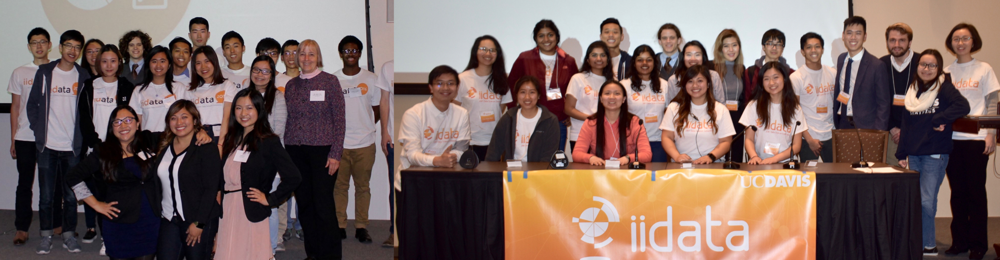
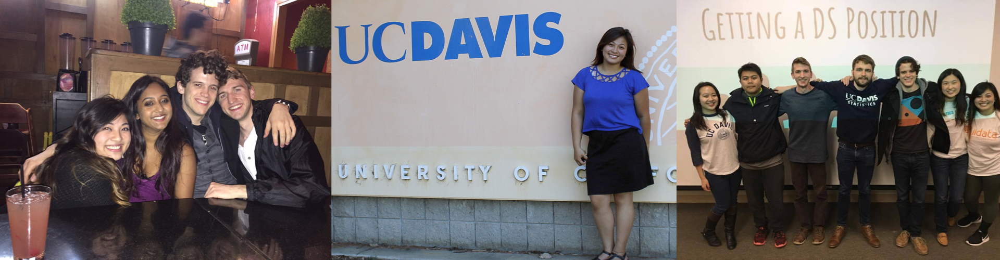

## Graduate Projects

### Computational Statistics with Applications in Biology and Medicine (PHC 240C)
Gene Expression Signatures of Endometriosis <a href="graduate/phc240c/endometriosis-report.pdf">report</a> and <a href="https://github.com/palautatan/endometriosis">repository</a>

## Undergraduate Projects

<ul>
<b>STA141B: Data & Web Technologies for Data Analysis</b>
<li><a href="project141b" title="Final Project">White House Petitions (Final Project)</a></li>
<li><a href="assignments/141b_assignment2.html" title="Image Processing and SVD">Manipulating A Picture of James (Image Processing and SVD)</a></li>
<li><a href="assignments/141b_assignment4.html" title="Fruit Database">Fruit Database (API's and Modeling)</a></li>
<li><a href="assignments/141b_assignment5.html" title="Web Scraping the Aggie">Web Scraping the Aggie (Webscraping and Natural Language Processing)</a></li>
<li><a href="assignments/141b_assignment6.html" title="Exploring San Francisco Data">San Francisco Data (SQL and Mapping)</a></li>
</ul>

<ul>
<b>STA138: Categorical Data Analysis</b>
<li><a href="assignments/138_project3_1.html" title="Multinomial Logistic Regression">School Dataset (Multinomial Logistic Regression)</a></li>
<li><a href="assignments/138_project3_2.html" title="Logistic Regression">Baby Dataset (Logistic Regression)</a></li>
</ul>

### Contact Me
```r
cat(letters[5], letters[8], letters[26], letters[5], "@live.com", sep="")
```


